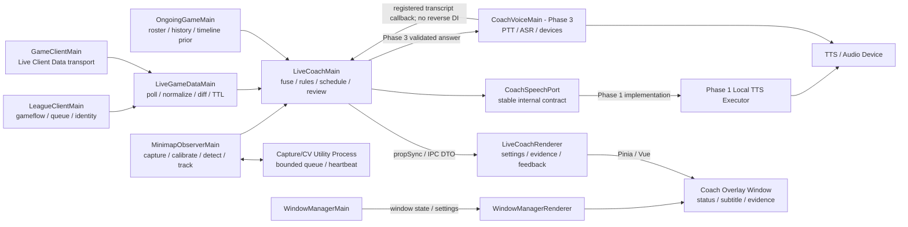

# League Akari 实时语音 AI 教练：三期完整功能清单

> 文档状态：产品范围与技术实施基线
> 版本：v1.0
> 最后更新：2026-08-25
> 首发平台：Windows 10/11
> 首发模式：召唤师峡谷 5v5
> 空间事实基准：玩家屏幕中当前可见的小地图
> 重要前提：真实游戏中的实时采集/分析与实时输出是两道独立闸门；两者在启用前都必须取得覆盖具体模式、地区、数据源和输出类别的书面合规确认。

## 0. 文档目的

本文把 League Akari 的“以小地图为准的实时战斗语音 AI 教练”拆成三个可独立验收、可逐步上线、可随时降级的阶段，并列出：

- 每一期面向用户的完整功能；
- 每一期的数据、算法、Shard、窗口与设置落点；
- 每一期明确不做的能力；
- 可量化的验收指标、退出条件和停止线；
- 跨三期共用的隐私、公平竞技、反作弊与补丁降级规则；
- 从离线回放、静默影子模式到公开发布的上线闸门。

本文是范围基线，不代表所有条目已经实现。清单中的 `[ ]` 表示待开发、待验证或待完成；“明确不做”章节中的 `[ ]` 表示需要验证该禁项确实不存在。只有达到对应阶段的完成定义，才可以将该阶段标记为完成。

已经冻结的 P0 选型、稳定接口和实施任务分别见 [P0 技术决策](./live-coach-p0-technical-decisions.md) 与 [开发交付规格](./live-coach-development-spec.md)。本文中的早期建议如与已冻结决策冲突，以 P0 技术决策为准。

研发范围只使用两类标签：

- **必做**：除红线外的所有功能都必须开发、测试并保留可运行实现；真实对局采集、实时提示、实时语音、ASR、LLM、SGP 与高级检测器都属于必做；
- **红线**：永久禁止开发、测试和发布；
- **对外启用开关**不是研发范围标签。审核、地区、版本、模式、设备质量和运营状态只决定功能是否面向外部用户启用；它们不得移出排期、阻塞编码或删除已完成实现；
- 未显式标注的带编号功能一律视为 **必做**。

## 1. 三期总览

| 阶段   | 产品定位       | 核心目标                           | 实时输出形态                               | AI 使用边界                                                   | 对外启用方式                                       |
| ------ | -------------- | ---------------------------------- | ------------------------------------------ | ------------------------------------------------------------- | -------------------------------------------------- |
| 第一期 | 小地图守望者   | 看得准、不过时、不乱说             | 本地短语音、提示音、字幕、状态提示         | 不使用 LLM，不使用麦克风；确定性规则                          | 全部开发；未完成外部审核时只由内部测试开关控制     |
| 第二期 | 小地图态势教练 | 看懂局势，解释风险，最多给两个选项 | 结构化宏观建议、证据卡片、关键时刻复盘     | 不使用生成式 AI；事实、场景、选项和语言均由本地确定性规则产生 | 全部开发；对外是否开启由地区、审核与质量开关控制   |
| 第三期 | 个性化对话教练 | 能问、能答、能复盘、能长期训练     | 按键说话、可打断语音、个性化计划与赛后闭环 | 受约束 LLM，只能基于已验证事实表达，不能创造当前事实          | 全部开发；审核结果只切换公开可见性，不改变开发范围 |

### 1.1 对“三期全部做完”的定义

“完成”分为两个互不替代的层面：

1. **研发完成**：所有非红线功能的代码、数据集、测试、性能、文档、诊断、回滚和远程熔断均达到本期验收线。
2. **对外公开**：研发完成后，再由 Riot、腾讯或其他地区发行方的产品注册、用途审核和公平竞技要求决定外部用户是否可见。

因此，三期全部功能都进入开发和内部测试。对外公开形态由两道独立开关决定：

1. **Gate A：实时采集/分析对外启用开关**。覆盖真实游戏窗口采集、小地图 CV、LCU/2999 使用、运行模式和地区。
2. **Gate B：实时输出对外启用开关**。覆盖字幕、提示音、语音、宏观选项、问答和商业模式。

Riot 侧对外开关的有效证据必须绑定已注册的具体产品、版本和功能 ID，并具有 Developer Portal 对新增功能/变更的 audit 记录或 Riot 的明确书面回复；泛化邮件、其他产品的状态和仅有兼容性测试均无效。腾讯国服对外启用另需独立具名授权。

Gate A/B 不改变开发计划。开发、离线夹具和项目负责人自用测试使用单独的内部测试开关；任何面向外部用户的真实游戏采集、实时提示和实时语音仍必须由 Gate A/B 分别控制。

如果最终审核未通过，对外版本必须将对应功能保持为关闭状态，而不是删除代码或停止后续开发：

- 赛前静态信息与一般训练目标；
- 用户主动导入自己的录像或回放后，在离线环境中分析；
- 赛后基于导入录像或离线夹具进行语音复盘；
- 面向外部用户时不连接真实游戏进程、不运行实时采集或影子评估；
- 面向外部用户时不发出实时决策性提示；
- 内部测试构建保留全部非红线功能、诊断和回归能力，并由项目负责人控制使用范围。

## 2. 产品原则与边界

### 2.1 六条不可破坏的产品原则

1. **可见证据优先**：空间类事实只来自当前屏幕中可见的小地图像素，不补全战争迷雾。
2. **当前事实优先**：实时观察高于历史倾向；历史数据不得覆盖当前可见证据。
3. **不确定就沉默**：无法定位小地图、识别置信度不足、画面过期或数据冲突时，不播报。
4. **描述风险并给选择**：产品设计上只说明“看到了什么、可能影响什么、有哪些选择”，不输出唯一强制指令；但“当前可见 + 多个选项”不是政策安全港，仍需逐功能审核。
5. **本地与最小化优先**：原始画面默认只在本机内存处理，不默认落盘，不默认上传。
6. **失效即关闭**：游戏补丁、分辨率、UI、采集、模型或数据源异常时，按能力粒度自动关闭，不带病运行。

### 2.2 教练允许输出的结构

每条正式语音或字幕由四部分中的必要子集组成：

1. **观察**：刚刚看到了什么；
2. **影响**：为什么值得注意；
3. **选项**：最多两个可选动作；
4. **时效**：该信息是否仍然有效。

示例：

> 上半区刚出现三人。你可以先等视野，或者转去下半区交换资源。

禁止把建议写成唯一且强制的命令，例如“立刻打龙”“马上去上”“现在必须开团”。

### 2.3 研发范围与红线

以下分类用于研发排期；对外启用仍由产品注册、地区审核和功能开关控制。

#### 必做：全部进入开发、测试与内部验证

- [ ] 玩家自己的赛后录像、回放和结构化事件复盘；
- [ ] 玩家自己的对局历史、聚合统计和长期习惯分析；
- [ ] 赛前静态英雄、符文、装备和一般性训练信息；
- [ ] 不针对当前对局决策的一般训练目标；
- [ ] 本地性能诊断、采集健康检查和无声回放评估。
- [ ] 将玩家屏幕上当前可见的小地图内容重新识别并实时播报；
- [ ] 使用 Live Client Data 触发当前对局中的动态提醒；
- [ ] 对当前局势给出宏观风险描述或多个选项；
- [ ] 当前对局中的计时、注意力提醒和语音问答；
- [ ] last-seen、多人聚集、跨图交换、回城窗口、资源准备等可能替代注意力或信息跟踪技能的聚合能力；
- [ ] 任何可能被理解为“游戏过程中此前未知的信息”或“替玩家做决策”的功能。

#### 红色：三期均永久排除

- [ ] 读取或写入游戏内存；
- [ ] DLL 注入、游戏 Hook、驱动注入、封包拦截或流量解密；
- [ ] 自动移动、自动施法、自动购买、自动点击、自动 Ping 或自动聊天；
- [ ] 还原战争迷雾、推断不可见敌人的精确位置或路线；
- [ ] 追踪未通过允许接口或当前可见画面获得的敌方技能、召唤师技能或大招冷却；
- [ ] 绕过、隐藏或规避 Vanguard/反作弊检测；
- [ ] 要求用户关闭安全软件、反作弊或系统保护；
- [ ] 未经授权的真人音色克隆；
- [ ] 以“保证上分、保证胜率”作为功能承诺。

Riot 当前开发者政策明确反对向玩家提供本局此前未知的信息，也反对替玩家做决定的应用。政策中“突出重要决策并提供多个选择”的表述不能被解释为实时小地图聚合、last-seen 或宏观建议的自动批准。该政策风险只影响外部启用决定，不改变本规划对这些功能的开发、测试和内部验证要求，详见[参考资料](#18-参考资料)。

腾讯国服对外启用独立处理：Riot Portal 的注册或批准不能替代腾讯授权。代码、测试和内部能力保持在开发范围内；只有对外启用时才要求具名的腾讯产品、法务或安全负责人书面回复覆盖“屏幕采集 + 小地图 CV + LCU/2999 + 实时输出 + 商业模式”。

**本规划的研发假设**：按 2026-08-25 可见的 Riot 公共政策，实时小地图聚合与动态宏观建议的公开状态尚不能预设。因此，离线和实时两条路径都必须完整开发；审核结果只决定地区、模式和功能 ID 的对外开关。离线产品本身仍需完成适用的产品注册、功能 audit、地区条款和隐私审核。

## 3. 当前项目基线

### 3.1 已有能力

| 现有模块                  | 可复用能力                                                       | 在教练项目中的用途                                       |
| ------------------------- | ---------------------------------------------------------------- | -------------------------------------------------------- |
| `league-client-main`      | LCU REST/WebSocket、gameflow、队列与选人阶段、客户端身份         | 自动开始/结束教练会话、识别模式与玩家                    |
| `game-client-main`        | 连接 `https://127.0.0.1:2999`，提供 Live Client Data HTTP 客户端 | 当前时间、玩家、等级、装备、死亡、事件等非空间事实       |
| `ongoing-game-main`       | 阵容、位置分配、历史战绩、时间线、SGP/LCU 分析                   | 赛前背景和历史先验；不承担高频实时轮询或视觉逻辑         |
| `respawn-timer-main`      | 以 1 秒周期读取玩家列表并生成复活信息                            | 迁移到统一实时数据层后继续保持现有外部契约               |
| CD Timer 窗口             | 以 4 秒周期读取游戏状态，具备悬浮窗基础                          | 复用透明、置顶、点击穿透和窗口生命周期经验               |
| `window-manager-main`     | 多窗口创建、位置持久化、置顶与显示控制                           | 新增专用教练悬浮窗                                       |
| `keyboard-shortcuts-main` | 全局快捷键注册                                                   | 静音、暂停、按键说话、重新标定                           |
| `feature-gating-main`     | 基于平台、应用版本和 SGP server 等上下文提供基础远程门控         | 作为教练能力矩阵的远程输入；现状不能直接表达全部教练维度 |
| `storage-main`            | SQLite 持久化                                                    | 第二期起存储结构化会话、反馈和复盘，不存默认原始画面     |
| `logger-factory-main`     | 统一日志                                                         | 模块化诊断、性能和错误追踪                               |

### 3.2 现有缺口

- [ ] 没有游戏画面采集后端；
- [ ] 没有小地图 ROI 定位、标定、图标检测与追踪；
- [ ] 没有统一的 2999 高频轮询与差分数据层；
- [ ] 没有实时事实 TTL、证据链和失效传播；
- [ ] 没有语音队列、播报优先级、本地 TTS 或 ASR；
- [ ] 没有教练专用主进程 Shard、renderer shard、设置页和悬浮窗；
- [ ] 没有视觉回放数据集、补丁回归集和误报评估工具；
- [ ] 没有云端 AI 网关、成本预算、结构化输出校验或隐私授权流程。

### 3.3 必须先解决的技术债

- [ ] 将复活计时器和 CD Timer 对 2999 的独立轮询收口到统一数据源，避免重复请求和不同步；
- [ ] 为目前未完整类型化的 Live Client Data 响应补齐共享类型与运行时校验；
- [ ] 保持现有 `respawn-timer-main`、CD Timer 和 renderer 的公开设置、IPC 与状态契约不变；
- [ ] 不把小地图高频帧、原始快照或教练状态塞进 `ongoing-game-main`；
- [ ] `platform.ts` 只保留纯平台 guard；Windows 采集、设备和音频副作用进入 executor 或独立进程桥；
- [ ] 增加教练专用 capability evaluator，将本地支持矩阵、会话、采集环境、书面许可和远程禁用项取交集；远程配置只能收窄，不能越权开启。

## 4. 目标架构

### 4.1 数据流



### 4.2 拟新增 Shard

| Shard                   | 首次引入 | 单一职责                                                 | 不承担的职责                                      |
| ----------------------- | -------- | -------------------------------------------------------- | ------------------------------------------------- |
| `live-game-data-main`   | 第一期   | 统一轮询 2999、校验、归一化、差分、时间戳和连接健康      | 不做视觉识别，不做教练决策，不直接播音            |
| `minimap-observer-main` | 第一期   | 采集、ROI 标定、当前可见图标检测、追踪、置信度与观察失效 | 不推断迷雾，不直接生成建议                        |
| `live-coach-main`       | 第一期   | 会话、事实融合、确定性规则、提示调度、证据链、复盘事件   | 不直接管理浏览器窗口，不把 LLM 当事实源           |
| `live-coach-renderer`   | 第一期   | 同步精简 DTO、设置、诊断、用户反馈和页面状态             | 不接收高频原始帧，不运行高频检测                  |
| `coach-voice-main`      | 第三期   | PTT、ASR、对话取消、设备管理、云端/本地语音编排          | 不独立创造对局事实，不绕过 `live-coach-main` 校验 |

从第一期起冻结 main-only 的 `CoachSpeechPort`。第一期由 `live-coach-main` 内部本地 executor 实现；第三期由 `CoachVoiceMain` adapter 实现。第一期已公开的输出设备、音量、语速、静音设置 key 和 renderer API 始终留在 `live-coach-main` namespace，不因内部实现替换而迁移。

依赖保持单向：`LiveCoachMain` 注入 `CoachVoiceMain`、注册 transcript callback 并调用 `speak()`；`CoachVoiceMain` 不反向注入 `LiveCoachMain`，避免 Shard 循环依赖。第三期所有回答仍先回到 `LiveCoachMain` 做候选集合、事实与时效校验，再交给语音层播放。

### 4.3 拟新增窗口与页面

- [ ] 主窗口新增“实时教练”入口、总开关、模式、设备、隐私和诊断页面；
- [ ] 新增独立的 `coach-overlay-window`，不复用 CD Timer 或 Ongoing Game 窗口；
- [ ] 窗口 namespace 固定为 `window-manager-main/coach-overlay-window`，不另造顶层 window shard；
- [ ] 悬浮窗支持透明、置顶、点击穿透、位置/缩放持久化；
- [ ] 通过快捷键临时进入交互态，交互结束后恢复点击穿透；
- [ ] 常规 propSync/IPC 只同步精简状态、字幕、证据摘要和用户反馈，不同步原始图像；
- [ ] 标定页如需预览，只允许用户主动请求有尺寸、频率和生命周期上限的一次性 ROI 图像；不得 propSync、不得持续推流；
- [ ] 主窗口关闭不影响已授权的对局内最小化教练运行；
- [ ] 游戏结束、客户端退出、采集失效或总暂停后立即停止播报并清空队列。
- [ ] `WindowManagerMain` 负责构造、生命周期和主进程状态；`WindowManagerRenderer` 负责 proxy/store；Vue 窗口只消费 renderer 状态；
- [ ] 增加 `src/renderer/coach-overlay-window.html`、electron-vite renderer input、`tsconfig.web.json` include/alias 和独立 renderer shard manager；
- [ ] 主窗口与 overlay 的 renderer manager 都注册 `LiveCoachRenderer`；overlay 同时注册 `WindowManagerRenderer` 及其 IPC、Pinia、settings、logger 依赖。

### 4.4 建议代码组织

以下是职责边界，不要求为每一行都创建小文件；只有当职责已有独立状态、生命周期、测试或多个调用方时再拆分。

```text
src/main/shards/
  live-game-data/
    index.ts
    context.ts
    state.ts
    live-client-data-loader.ts
    polling-controller.ts
  minimap-observer/
    index.ts
    context.ts
    state.ts
    capture-process-supervisor-controller.ts
    frame-capture-executor.ts
    calibration-controller.ts
    observation-controller.ts
    platform.ts                         # 只含纯 platform guard
    ipc-handlers.ts                    # 仅标定/一次性 ROI preview 等真实 caller
  live-coach/
    index.ts
    context.ts
    state.ts
    session-controller.ts
    fact-fusion.ts                      # 仅在无状态、无 IO 时保持纯函数
    rule-engine.ts                      # 仅在无状态、无 IO 时保持纯函数
    cue-scheduler-controller.ts
    coach-capability-controller.ts
    speech-port.ts
    local-speech-executor.ts
    review-controller.ts
    ipc-handlers.ts
    model-orchestration-controller.ts       # 第三期
    model-request-executor.ts               # 第三期
    response-validator.ts                   # 第三期纯校验
    knowledge-loader.ts                     # 第三期
  coach-voice/                 # 第三期达到独立生命周期后新增
  window-manager/
    coach-overlay-window/
      window.ts
      state.ts
  storage/
    entities/
      coach-session.ts          # 第二期，名称按现有 Entity 约定最终确定

src/main/utility-processes/
  minimap-observer/            # 独立 OS 进程入口、采集/CV runtime、心跳与 DTO

src/renderer-shared/shards/
  live-coach/

src/renderer/src-coach-overlay-window/
  shards/
  App.vue
  main.ts
  NaiveUIProviderApp.vue

src/renderer/
  coach-overlay-window.html

src/shared/types/
  live-game-data/
  live-coach/
```

`index.ts` 只负责依赖注入、SettingFactory、propSync、模块构造、生命周期和薄公开 API。可失败/可取消的单次 OS、设备或网络调用放 executor；多端点读取与归一化放 loader；拥有定时器、可变队列、订阅或重试状态的单元使用 `*-controller.ts`。

注册清单：

- [ ] 第一期在 `src/main/bootstrap/index.ts` 注册 `LiveGameDataMain`、`MinimapObserverMain` 和 `LiveCoachMain`；
- [ ] 第三期注册 `CoachVoiceMain`，并保持 `LiveCoachMain -> CoachVoiceMain` 的单向 DI；
- [ ] 每个需要教练状态的 renderer window 在自己的 shard manager 注册 `LiveCoachRenderer`；
- [ ] overlay renderer manager 注册 `WindowManagerRenderer` 与实际依赖；
- [ ] 没有直接 renderer caller 时，不给 `live-game-data-main` 创建公共 IPC namespace，健康摘要由 `LiveCoach` DTO 暴露。

窗口集成清单：

- [ ] `WindowManagerMain` 增加 `coachOverlayWindow` 属性、构造、初始化/销毁和 lifecycle map；
- [ ] `src/main/shards/window-manager/coach-overlay-window/{window.ts,state.ts}` 复用现有 base window 契约；
- [ ] `WindowManagerRenderer` 的 `context.ts` 增加 main namespace 常量，`store.ts` 增加同步状态，`windows.ts` 增加 proxy，`index.ts` 完成初始化；
- [ ] `src/renderer/src-coach-overlay-window/shards/index.ts` 构造该窗口自己的 shard manager；
- [ ] `electron.vite.config.ts` 新增 HTML input，`tsconfig.web.json` 增加 include/alias；
- [ ] IPC handler 名使用 camelCase，renderer event 使用 kebab-case，不手写 success/error envelope。

采集/CV 运行在 Electron `utilityProcess` 或 `child_process` 等真正的 OS 进程边界，不使用同进程 Worker 冒充崩溃隔离。`MinimapObserverMain` 只负责启动、心跳、超时、背压、重启和停止；进程通信必须使用有界队列、单调序列号、采集时间戳、最大 frame age 和丢帧策略。原生 runtime 崩溃不能带走 Electron main。

### 4.5 共享数据契约

当前观察与历史证据必须在类型层分开，不能依赖运行时约定：

```ts
interface EvidenceBase<TSource extends string, TPayload> {
  id: string;
  source: TSource;
  confidence: number;
  patch: string;
  payload: TPayload;
}

interface CurrentObservation<T> extends EvidenceBase<
  "minimap" | "live-client-data" | "lcu-gameflow",
  T
> {
  temporalScope: "current";
  observedAt: number;
  expiresAt: number;
  sequence: number;
}

interface RecordedObservation<T> extends EvidenceBase<
  "minimap-replay" | "replay-sidecar",
  T
> {
  temporalScope: "recorded";
  artifactId: string;
  occurredAt: number;
  sequence: number;
}

interface HistoricalEvidence<T> extends EvidenceBase<
  "lcu-history" | "sgp-history",
  T
> {
  temporalScope: "historical";
  rangeStart: number;
  rangeEnd: number;
  fetchedAt: number;
}

interface CoachCue {
  id: string;
  category: "information" | "warning" | "opportunity" | "review";
  priority: number;
  text: string;
  evidenceIds: string[];
  createdAt: number;
  expiresAt: number;
  status: "pending" | "speaking" | "spoken" | "cancelled" | "expired";
}
```

Renderer 只获得稳定、精简的公开 DTO：

- [ ] `CoachStatus`：运行、暂停、采集、标定、版本和降级状态；
- [ ] `CoachPlan`：本局或本阶段的训练目标；
- [ ] `CoachTask`：当前阶段任务和完成状态；
- [ ] `CoachCue`：已校验的提示及其可展示证据摘要；
- [ ] `CoachReview`：赛后关键时刻与训练总结；
- [ ] `CoachFeedback`：有用、错误、太晚、太频繁等用户反馈。
- [ ] `CoachReplaySession`：导入 artifact、元数据、sidecar、`RecordedObservation`、时间轴和派生问答；
- [ ] `CoachReplaySidecar`：可选结构化录像上下文、字段来源、schema 版本和视频/游戏时间映射。

录像时间轴与问答按需分页 IPC 读取，不通过 propSync 同步整局记录；原始录像帧仍只通过受控的一次性预览或本地播放路径访问。

跨传感器融合必须记录每个来源的采集时钟与最大偏差。第一期以实测校准一个 `maxSensorSkewMs`；超过门槛的观察不得被组合成同一个当前结论。系统时钟回拨、休眠唤醒或进程重启时清空当前观察。

### 4.6 统一 2999 的 main-only 契约

`LiveGameDataMain` 复用现有 `GameClientMain.api`，不得创建第二个 2999 HTTP client。对 main-process 消费者提供：

- [ ] 只读的 normalized snapshot；
- [ ] 带 domain、首次快照和 replay 语义的 typed subscribe API；
- [ ] 每次订阅返回 disposer，Shard dispose 与跨局 reset 必须释放；
- [ ] 轮询仅在至少一个消费者和有效 gameflow 会话同时存在时激活；
- [ ] 游戏结束先发布 reset，再停止轮询；新一局不能 replay 旧事件；
- [ ] snapshot 与差分事件都带 observedAt、sequence、freshness 和 source health。

依赖方向固定为：

```text
GameClientMain
  -> LiveGameDataMain
      -> RespawnTimerMain
      -> WindowManagerMain / CD Timer Window
      -> LiveCoachMain
```

旧功能兼容表：

| 消费者               | 必须保持不变                                                                                 | 只允许替换的内部实现                                |
| -------------------- | -------------------------------------------------------------------------------------------- | --------------------------------------------------- |
| `respawn-timer-main` | Shard id、`settings.enabled`、`state.info` propSync、renderer store shape                    | 删除自己的 1 秒请求，订阅统一 player/respawn domain |
| CD Timer             | `window-manager-main/cd-timer-window` namespace、settings/state、`sendInGame` IPC 与窗口行为 | 删除自己的 4 秒 game-stats 轮询，读取统一 snapshot  |

### 4.7 结构化存储边界

- [ ] 第一期会话摘要只保留在内存，用户可主动导出；应用退出后消失，不另建私有 JSON 存储；
- [ ] 第二期才引入 SQLite 会话历史，并增加显式 Entity、DataSource entities 注册、数据库版本升级和迁移；
- [ ] `LiveCoachMain` 中由真实 storage loader/executor 负责读取、写入、保留期和删除；
- [ ] 原始 ROI 帧与结构化会话使用不同授权、不同表或不同存储位置，不能因保存复盘而隐式保存图像。

## 5. 事实来源与字段级权威

事实不使用一个全局线性优先级。每个字段都声明 `temporalScope`、权威来源、允许的备用来源、最大时钟偏差和 TTL。

| 来源                 | 时间范围      | 可以证明                                                 | 不能证明                                         | 回退规则                               |
| -------------------- | ------------- | -------------------------------------------------------- | ------------------------------------------------ | -------------------------------------- |
| 刚采集的小地图像素   | 当前          | 当前画面中确实可见的图标、区域、数量和短时几何趋势       | 迷雾内位置、敌方意图、真实路线、未显示冷却       | 不回退到历史位置；失败即 `unknown`     |
| Live Client Data     | 当前          | 时间、玩家、等级、装备、分数、死亡、部分事件等非空间事实 | 地图坐标；`position` 是分路/位置，不是地图坐标   | 只在语义等价端点间回退；过期即不可用   |
| LCU gameflow/session | 当前          | 客户端阶段、队列、地图和会话身份等客户端事实             | 小地图空间位置                                   | 本地 LCU 不可用时停止相关生命周期      |
| LCU 历史接口         | 历史          | 当前区服下客户端暴露的历史数据                           | 当前局空间事实、跨区数据                         | 可在语义等价时作为 SGP 历史失败的回退  |
| SGP                  | 历史/赛前增强 | 目标端点、目标区服和授权均有效时的后台数据               | 通用跨区能力、当前小地图事实                     | 仅端点级、语义等价回退；否则显示不可用 |
| 第三期 LLM           | 表达层        | 完整表达本地已生成的候选集合、适用条件或拒答             | 当前事实、不可见事实、额外动作、替用户选唯一动作 | 失败回退本地模板                       |

SGP 使用前必须分别检查：

- [ ] League session 与 entitlements 两类 token 均达到当前 auth 层要求；
- [ ] 远程配置中存在目标 server 的明确端点和路径变量；
- [ ] 该具体功能声明了 endpoint capability；
- [ ] 当前 token、目标 region 与该 endpoint 的互操作性已验证；
- [ ] 直接 SGP 网络路径可用；加速器/VPN 下 LCU 健康不代表 Akari 的 SGP 直连健康；
- [ ] 区分“配置缺失、token 未就绪、端点不支持、地区不兼容、网络失败、玩家不存在”；
- [ ] 只有结果语义等价时才回退 LCU，不得把不同含义的数据静默替换；
- [ ] 腾讯跨子区能力逐 endpoint 验证，不能从共享 host、相似 URL 或旧配置字段推断。

冲突处理规则：

- [ ] 当前可见证据与历史倾向冲突时，以当前可见证据为准；
- [ ] 小地图与 Live Client Data 表达不同维度时，不互相补全不存在的字段；
- [ ] LCU 的当前 gameflow 与 LCU/SGP 历史数据使用不同 `temporalScope`；
- [ ] 超过 `maxSensorSkewMs` 的观察不进行当前事实融合；
- [ ] 两个当前来源发生无法解释的冲突时，相关提示取消；
- [ ] 任何证据过期或被后续观察推翻时，等待队列中的语音立即取消；
- [ ] 已经开始播放但事实失效时，立即打断；必要时用简短撤回音提示，不继续解释；
- [ ] 所有赛后复盘都保留“当时已知证据”，不能用事后结果伪装成实时判断。

## 6. 三期共用的实时安全规则

### 6.1 观察状态机

- [ ] `candidate`：首次检测到，但帧数或置信度不足；
- [ ] `confirmed`：满足连续帧与置信度门槛，可供规则引擎使用；
- [ ] `invalidated`：被新观察否定，关联待播提示立即取消；
- [ ] `expired`：超过 TTL，不能继续作为当前事实；
- [ ] `unknown`：采集、标定或分类失败，系统必须保持沉默。

### 6.2 默认确认门槛

- [ ] 每个检测器按“最少样本数 + 最短稳定时长 + 置信度”独立定义门槛；
- [ ] 普通观察默认至少 2 个一致样本并覆盖 ≥200ms；
- [ ] 高优先级危险观察默认至少 3 个一致样本并覆盖 ≥300ms，或由第二个允许的数据源交叉确认；
- [ ] 单帧结果不得直接生成语音；
- [ ] UI 可以显示低置信度诊断，但不能把它包装成确定事实；
- [ ] 实时视觉最低有效处理频率为 5 FPS；低于该值或 frame age 超线时转为 `unknown`，不能靠降低采样继续声称实时指标达标；
- [ ] 自适应频率有滞回，恢复到最低频率并持续健康一段时间后才能重新输出；
- [ ] 阈值按检测器独立配置，不能用一个全局阈值掩盖类别差异。

### 6.3 默认语音节流

- [ ] 同时最多保留 1 条等待语音；
- [ ] 新的高优先级提示可以替换未开始的低优先级提示；
- [ ] 普通提示之间默认至少间隔 20 秒；
- [ ] 同语义类别默认冷却至少 90 秒；同一事件发生明确风险升级时可例外，但必须留下升级证据；
- [ ] 硬性 burst cap 为最多 2 条/分钟、6 条/10 分钟、18 条/局；
- [ ] 极简、均衡和训练模式默认只能下调硬上限；任何上调都作为独立必做能力重新评估并通过内部测试；
- [ ] 高负荷团战窗口只允许最高优先级短警报；
- [ ] 危险短警报目标不超过 12 个汉字或 2.2 秒；
- [ ] 第二期解释型提示首句不超过 2.2 秒、总语音不超过 5 秒；第三期问答首句优先、总语音不超过 8 秒，剩余内容转字幕；
- [ ] 超过 2.5 秒仍未播出的实时提示直接丢弃；
- [ ] 证据失效后，正在播放的语音必须在 p95 200ms 内停止；
- [ ] 记录提示播放时的 evidence age、打断率、撤回率、语音 duty cycle 和与 PTT/其他语音的重叠率；
- [ ] 用户总静音、暂停或禁用某类别后，正在等待和播放的对应语音立即停止。

### 6.4 补丁与远程熔断

- [ ] 未知游戏补丁一律 fail-closed，不由单个用户的首次运行自动恢复；
- [ ] 视觉资源、模型、规则和指标基线绑定游戏版本；
- [ ] 支持按地区、队列、地图、分辨率、采集后端、检测器、语音类别逐项关闭；
- [ ] 远程配置不可开启本地构建中不存在的能力；审核未完成时只关闭外部版本对应入口，不影响内部测试开关；
- [ ] 恢复清单由中心化回放与获准 shadow 样本生成，绑定 patch、模型、规则、采集后端、地区和许可版本，并经双人审批；
- [ ] 远程清单必须签名，包含 TTL、防回滚序号和时钟异常策略；
- [ ] 无法获取远程配置时只使用 TTL 内的最后安全快照；过期、签名失败、序号回退或时钟异常时关闭；
- [ ] 建立 Riot 国际服与腾讯国服两套独立的政策、反作弊、联系人、信号源和 kill switch；
- [ ] 出现 Vanguard/国服安全组件警告、封禁关联怀疑、隐私事件或大规模黑屏时，一次即全局熔断实时能力并保全诊断证据。

---

## 7. 第一期：小地图守望者

### 7.1 本期目标

第一期只解决“看得准、不过时、不乱说”。它要把实时采集、视觉事实、Live Client Data、证据链、短语音、悬浮状态和评估工具完整跑通，但不引入麦克风、自由对话或 LLM。

第一期全部必做工程在 P0 选型和数据规模验证后实施，工期与可达指标仍属于 discovery 结论。Gate A/B 仅控制面向外部用户的启用；项目负责人自用测试、离线录像/回放和内部验证均按完整一期范围推进。

范围覆盖规则：P0、第 7.3–7.11 节、验收指标、停止线和交付物中的所有非红线执行路径与指标均为必做。离线、实时采集、实时分析、影子、有声输出和内部测试共用同一研发排期；对外启用由独立开关决定。

### 7.2 P0 技术验证

- [ ] **P1-001** 对比 Electron `desktopCapturer`、Windows Graphics Capture 与 DXGI Desktop Duplication；
- [ ] **P1-002** 验证窗口化、无边框、独占全屏、最小化、Alt+Tab、双屏和不同 DPI 的采集行为；
- [ ] **P1-003 [必做]** 在项目负责人自用测试、离线夹具和内部测试环境验证采集兼容性，不注入、不 Hook、不修改游戏进程；“没有警告/封禁”只证明该测试样本未冲突，不代表获准、allowlist 或未来无风险；对外启用仍由 Gate A 控制；
- [ ] **P1-004** 使用离线录像与可控桌面夹具验证 1080p/1440p、5–10 FPS 小地图裁剪的吞吐、CPU、GPU、内存和 p99 frame time；
- [ ] **P1-005** 验证系统本地 TTS 的中文可用性、首包延迟、音频设备选择和取消能力；
- [ ] **P1-006** 制作最小回放夹具：原始帧、ROI、标注、期望观察、期望提示和时间轴；
- [ ] **P1-007** 输出采集后端与视觉运行时 ADR，记录选型、失败模式、回退路径和许可证；
- [ ] **P1-008** P0 未达到性能或兼容性门槛时，不进入公开实时功能开发，保留赛后回放方向。
- [ ] **P1-009** 验证 utility process/child process 打包入口、心跳、崩溃隔离、有界队列、背压和 crash-loop 熔断。
- [ ] **P1-019 [必做]** 在项目负责人自用测试与内部基准矩阵验证 0.1%/1% low FPS、采集兼容和端到端资源影响；对外启用仍由 Gate A 控制。

### 7.3 会话与生命周期

- [ ] **P1-010** 根据 LCU gameflow 自动识别选人、加载、进行中、结算和退出；
- [ ] **P1-011** 仅在支持的地图、队列、地区和版本上允许创建实时会话；
- [ ] **P1-012** 识别当前玩家、双方阵容、英雄资源版本和游戏补丁；
- [ ] **P1-013** 游戏进入可采集状态后启动，退出或进程消失后立即停止；
- [ ] **P1-014** 处理中途重连、客户端重启、游戏崩溃和网络短暂断开；
- [ ] **P1-015** 会话重建时清空旧的观察、计时、语音和证据，不跨局污染；
- [ ] **P1-016** 主窗口关闭、托盘运行和窗口重新打开时保持一致状态；
- [ ] **P1-017** 用户暂停后仍显示暂停原因，但不继续采集或播报敏感能力；
- [ ] **P1-018** 游戏结束后生成仅在当前应用会话内存中保留的结构化摘要；用户可主动导出，应用退出后清除。

### 7.4 统一 Live Client Data

- [ ] **P1-020** 新建 `live-game-data-main`，统一管理 `https://127.0.0.1:2999` 连接；
- [ ] **P1-021** 为 `playerlist`、`activeplayer`、`allgamedata`、`eventdata`、`gamestats`、装备、技能和分数补齐共享类型；
- [ ] **P1-022** 对关键响应增加运行时 schema 校验，字段变化时输出可诊断错误并降级；
- [ ] **P1-023** 使用单一调度器按端点设置轮询频率、超时、取消、退避和恢复；
- [ ] **P1-024** 对响应生成单调时间戳、游戏时间、版本、来源和新鲜度；
- [ ] **P1-025** 归一化玩家、队伍、等级、装备、死亡、复活、分数和事件；
- [ ] **P1-026** 只发布差分后的领域事件，避免每帧把完整快照推给消费者；
- [ ] **P1-027** 连接失败时区分“未进入游戏、接口暂不可用、响应不兼容、请求超时”；
- [ ] **P1-028** 迁移复活计时器到统一数据层，同时保持原有设置、IPC 和 renderer 契约；
- [ ] **P1-029** 迁移 CD Timer 的游戏状态来源，同时保持现有窗口行为；
- [ ] **P1-030** 对所有消费者共享一次轮询结果，禁止每个功能重复请求 2999；
- [ ] **P1-031** 明确 Live Client Data 不提供地图坐标，不把分路 `position` 当空间位置；
- [ ] **P1-032** 为采集循环、超时、退避、取消和游戏结束编写集成测试。

### 7.5 小地图采集与标定

- [ ] **P1-040** 新建 `minimap-observer-main` 并隔离 Windows 平台实现；
- [ ] **P1-041** 精确选择 League 游戏窗口，不采集客户端、桌面或错误进程；
- [ ] **P1-042** 首次启用时展示采集权限、用途、隐私和关闭方式；
- [ ] **P1-043** 支持 1920×1080 与 2560×1440、16:9、100%–150% 常见 DPI；
- [ ] **P1-044 [必做]** 首发支持窗口化与无边框；独占全屏完成独立验证后加入支持矩阵；
- [ ] **P1-045** 自动识别小地图在左侧或右侧、边界、尺寸和 UI 缩放；
- [ ] **P1-046** 自动标定失败时提供手动拖框、缩放、确认与重置；
- [ ] **P1-047** 只裁剪小地图 ROI 进入视觉管线，不持续处理完整游戏画面；
- [ ] **P1-048** 默认以 5–10 FPS 处理；自适应降频不得低于 5 FPS，低于下限直接进入 `unknown`；
- [ ] **P1-049** 检测黑帧、冻结帧、遮挡、最小化、分辨率变化和采集源切换；
- [ ] **P1-050** 标定健康状态包含 `healthy/degraded/unknown/unsupported`；
- [ ] **P1-051** 健康状态不是 `healthy` 时禁止生成正式语音；
- [ ] **P1-052** 运行中分辨率、窗口、UI 缩放变化时自动重新标定；
- [ ] **P1-053** 原始帧默认只保存在内存环形缓冲区，最长不超过 10 秒；
- [ ] **P1-054** 默认不写入磁盘、不截图上传、不记录完整桌面；
- [ ] **P1-055** 诊断导出必须由用户主动触发，并在导出前显示具体包含内容；
- [ ] **P1-056** 采集/CV 独立 OS 进程崩溃可重启，不拖垮 Electron 主进程；短窗内连续崩溃触发 crash-loop 熔断；
- [ ] **P1-057** 对不支持的 HDR、超宽屏、色盲模式或特殊 UI 明确显示“不支持”，不猜测运行。

### 7.6 第一期视觉能力

- [ ] **P1-060** 根据本局阵容加载最小必要英雄头像模板或模型类别；
- [ ] **P1-061** 识别自己、友方和当前可见敌方英雄图标；
- [ ] **P1-062** 输出标准化小地图坐标与粗粒度区域，如上半区、河道、下半区、己方野区；
- [ ] **P1-063** 识别当前画面中的可见人数变化；
- [ ] **P1-064** 识别单个图标首次出现、持续可见、短暂遮挡、重新出现和消失；
- [ ] **P1-065** 消失只表示“画面中已不可见”，不得转述为其仍在某个位置；
- [ ] **P1-066** 识别多个当前可见敌方图标在同一区域聚集；
- [ ] **P1-067 [必做]** 识别多个当前可见图标从不同方向朝玩家或某区域接近的几何趋势，不描述为“包夹意图”；
- [ ] **P1-068** 对图标重叠、缩放、边框、死亡状态、皮肤/头像相似和特效遮挡做专项样本；
- [ ] **P1-069** 使用时间平滑和追踪 ID，避免单帧跳变与重复事件；
- [ ] **P1-070** 每个观察输出坐标、区域、类别、置信度、帧时间、过期时间和模型版本；
- [ ] **P1-071** 低于阈值、类别冲突或追踪丢失时输出 `unknown`；
- [ ] **P1-072** 每个检测器可以单独远程关闭并回退到更粗粒度结果；
- [ ] **P1-073** 建立跨英雄、阵容、分辨率、UI 缩放、地图侧和亮度的标注集；
- [ ] **P1-074** 建立每个补丁的固定回归集，并记录 F1、区域准确率、误报与性能；
- [ ] **P1-075** 检测器模型和资源使用可复现版本号与校验和。

### 7.7 第一期教练事件

第一期只播报高置信、短时有效、直接可见的事实或注意力提示。

- [ ] **P1-080** “某区域出现多个当前可见敌人”；
- [ ] **P1-081 [必做]** “多个当前可见敌人正在靠近玩家所在区域”；
- [ ] **P1-082 [必做]** “当前可见敌人正在向上半区/河道/下半区聚集”；
- [ ] **P1-083** “小地图状态发生高优先级变化，请看地图”；
- [ ] **P1-084** 结合允许的 Live Client Data 提示死亡、复活或已发生的目标事件；
- [ ] **P1-085** 每类事件都有独立的连续帧、置信度、TTL、优先级和冷却；
- [ ] **P1-086** 同一证据只生成一次语义事件，区域轻微抖动不重复播报；
- [ ] **P1-087** 新观察推翻事件时，在 300ms 内取消等待语音；
- [ ] **P1-088** 提示只包含事实与“关注”性质，不生成“去哪里做什么”的唯一决策；
- [ ] **P1-089** 不把“敌人图标消失”直接解释成 Missing、游走路线或抓人意图；
- [ ] **P1-090** 规则引擎完全确定性，可由同一回放稳定复现相同输出；
- [ ] **P1-091** 每条提示保存触发规则版本和证据 ID，支持赛后审计；
- [ ] **P1-092** 没有满足条件的事件时保持安静，不为维持存在感而讲话。

### 7.8 本地语音、字幕与声音

- [ ] **P1-100** 使用系统或本地离线 TTS，中文为首发语言；
- [ ] **P1-101** 支持选择系统语音、音频输出设备、音量和语速；
- [ ] **P1-102** 支持纯提示音（earcon）、短语音、仅字幕和完全静音四种输出；
- [ ] **P1-103** TTS 文本从受版本控制的短句模板生成，不由 LLM 自由生成；
- [ ] **P1-104** 新高优先级提示可以打断低优先级语音；
- [ ] **P1-105** 事实失效、暂停、静音、游戏结束时立即取消合成与播放；
- [ ] **P1-106** 音频设备断开时降级到字幕，并显示可恢复错误；
- [ ] **P1-107** 首次播报前提供音量测试，不在正式对局中突然播放测试音；
- [ ] **P1-108** 每条语音记录排队、开始、结束、取消和延迟，不记录系统其他声音；
- [ ] **P1-109** 提供“一键静音”和“一键暂停教练”全局快捷键；
- [ ] **P1-110** 默认不申请麦克风权限，不监听语音，不录制队伍语音。
- [ ] **P1-111** 提供中文英雄、装备、地图区域和目标名称发音词典；
- [ ] **P1-112** 系统缺少可用中文音色时，TTS 自检必须失败并明确回退提示音/字幕，不能临场静默失败。

### 7.9 第一期 UI 与设置

- [ ] **P1-120** 实时教练总开关，默认关闭；
- [ ] **P1-121** 首次启用向导：能力说明、支持矩阵、隐私、风险、快捷键和测试；
- [ ] **P1-122** 小地图标定页只显示必要 ROI 预览，并可隐藏图像只看框线；
- [ ] **P1-123** 展示采集源、分辨率、帧率、标定状态、置信度、补丁和模型版本；
- [ ] **P1-124** 展示最后一条观察、最后一条提示、证据来源、生成时间和过期状态；
- [ ] **P1-125** 输出模式：低频、标准、静默影子；影子模式必须开发并在内部测试开关下可用，面向外部用户时由 Gate A 控制；“训练模式”的解释型内容从第二期开始；
- [ ] **P1-126** 语音类别开关：信息、危险、目标事件、系统状态；
- [ ] **P1-127** 语音/提示音/字幕、音量、语速、声音和输出设备设置；
- [ ] **P1-128** 全局静音、暂停、重新标定快捷键设置；
- [ ] **P1-129** 悬浮窗开关、透明度、大小、位置和点击穿透；
- [ ] **P1-130** 悬浮窗最小状态条：运行/暂停、采集健康、当前置信度和最后提示；
- [ ] **P1-131** 不支持环境给出具体原因和解决入口，不显示模糊的“AI 出错”；
- [ ] **P1-132** 诊断页支持本地自检、TTS 测试、采集测试和匿名性能摘要；
- [ ] **P1-133** 赛后在当前应用会话内显示“本局检测到什么、原本会说什么”的内存摘要，并提供主动导出；
- [ ] **P1-134** 所有新增界面支持中文 i18n，交互控件使用现有 Naive UI 与主题系统。

### 7.10 第一期隐私、诊断与运营

- [ ] **P1-140** 原始像素默认上传量为 0、默认持久化量为 0；
- [ ] **P1-141** 用户主动加入数据改进计划后，逐项选择 ROI 帧、诊断日志或指标；
- [ ] **P1-142** 明示保留时间、用途、上传目标和删除方法；
- [ ] **P1-143** 诊断日志去除召唤师名、完整桌面路径、令牌和其他敏感字段；
- [ ] **P1-144** 上传前在本地裁剪为小地图 ROI，并提供预览与撤销；
- [ ] **P1-145** 支持一键导出、一键删除本机教练数据；
- [ ] **P1-146** 记录检测器耗时、队列延迟、取消率、误报反馈、FPS 影响和崩溃；
- [ ] **P1-147** 不记录麦克风、队伍语音、系统音频或完整游戏录像；
- [ ] **P1-148** 远程指标只传结构化结果和设备档位，不传默认原始图像；
- [ ] **P1-149** 提供总 kill switch 和按检测器/地区/版本的细粒度 kill switch；
- [ ] **P1-150** 发布包、模型、资源和远程配置均可验证完整性。

### 7.11 合规基线交付：离线录像/回放分析

该能力是第一期必做功能，不是“可降级”的占位描述。

- [ ] **P1-160** 用户主动选择自己有权处理的本地录像文件；
- [ ] **P1-161** P0 冻结首发容器、编码、分辨率和帧率支持矩阵，解码器许可证进入 ADR；
- [ ] **P1-162** 本地解码并只提取分析所需帧，不上传完整录像；
- [ ] **P1-163** 自动寻找小地图 ROI，失败时使用与实时模式相同的手动标定；
- [ ] **P1-164** 支持手动标记游戏开始时间，或从可验证画面事件自动对齐；
- [ ] **P1-165** 在可拖动时间轴上展示观察、置信度、失效与拟播提示；
- [ ] **P1-166** 允许按真实速度、加速或单步运行同一观察与规则引擎；
- [ ] **P1-167** 播放“当时会说什么”的模拟语音，但明确标记为离线复盘；
- [ ] **P1-168** 导出结构化 JSON/Markdown 摘要、版本、指标和诊断；
- [ ] **P1-169** 用户可取消任务并删除所有临时帧、缓存和导出；
- [ ] **P1-170** 不连接、注入或控制正在运行的游戏进程；
- [ ] **P1-171** 对解码错误、可变帧率、音画时间轴偏差和中途剪辑给出可诊断状态；
- [ ] **P1-172** 同一录像、模型和规则版本产生确定性结果；
- [ ] **P1-173** 录像导入、标定、时间轴同步、取消和清理具有端到端测试；
- [ ] **P1-174** 外部发布开关关闭实时能力时，正式版入口只展示该离线能力与赛前静态能力；内部测试构建保留实时入口。
- [ ] **P1-175** 导入向导自动读取可用容器元数据，并要求用户确认游戏补丁、地图/模式、蓝红方、小地图侧和本人英雄；
- [ ] **P1-176** 通过经过验证的可见 UI/OCR 或用户手动选择补齐双方阵容；无法确认时使用“友方/敌方未知身份”类别；
- [ ] **P1-177** 定义可选的 `CoachReplaySidecar` schema，按视频时间轴提供玩家、等级、装备、死亡、已发生目标事件等结构化事实；
- [ ] **P1-178** sidecar 必须来自用户自己的获准数据或工具导出，带来源、版本和时间戳；不得从不可见内容或事后猜测生成；
- [ ] **P1-179** 支持手动对齐录像时间与 sidecar game time，并显示最大同步误差；
- [ ] **P1-180** 缺少补丁时只运行不依赖版本资源的能力；缺少地图/阵营时不输出区域语义；
- [ ] **P1-181** 缺少阵容时不做英雄身份结论；缺少本人英雄/坐标时不做“靠近玩家”判断；
- [ ] **P1-182** 缺少 sidecar 时，第二期所有依赖等级、装备、死亡或目标事件的规则自动关闭；
- [ ] **P1-183** UI 在分析前列出“可用能力/已关闭能力/缺失字段”，复盘中持续标注数据来源；
- [ ] **P1-184** 元数据、sidecar 校验、时间轴同步和缺失字段降级矩阵具有契约与端到端测试。

### 7.12 第一期明确不做

- [ ] **P1-X01** 不使用 LLM、云端生成式 AI 或自由文本提示；
- [ ] **P1-X02** 不申请麦克风，不做问答、唤醒词或持续监听；
- [ ] **P1-X03** 不做微操、连招、走位、技能释放、补刀或装备购买指导；
- [ ] **P1-X04** 不推断不可见敌人、战争迷雾、路线或意图；
- [ ] **P1-X05** 不追踪未经允许来源获得的敌方冷却；
- [ ] **P1-X06** 不自动控制游戏，不自动 Ping 或发送聊天；
- [ ] **P1-X07** 不默认支持 4K、超宽屏、HDR、色盲模式、极端 UI 缩放；
- [ ] **P1-X08** 不支持极地大乱斗、斗魂竞技场或其他地图；
- [ ] **P1-X09** 不把赛前历史差异转化为对当前玩家的标签化播报；
- [ ] **P1-X10** 不承诺“AI 全知”“零误报”或任何上分结果。

### 7.13 第一期验收指标

一期完成由全部非红线能力共同阻塞：离线导入/元数据/sidecar、离线标定、真实游戏采集兼容、视觉准确率、规则确定性、端到端实时延迟、游戏 FPS 影响、影子、有声试验、真实游戏 crash-free、隐私、导出/删除和离线吞吐均须达标。审核只影响外部开关，不降低研发验收线。

| 类别      | 退出指标                                                                                                                                        |
| --------- | ----------------------------------------------------------------------------------------------------------------------------------------------- |
| 标定      | 按会话启动统计，支持矩阵内 ROI 定位成功率 ≥99%；失败必须进入 `unknown`                                                                          |
| 灾难错框  | `false-healthy` 事件为 0，且单侧 95% 置信上界低于预设 hard limit                                                                                |
| 可见事件  | episode-level Precision 的 95% 下界 ≥98%，Recall 的 95% 下界 ≥85%；粗区域准确率下界 ≥98%                                                        |
| 覆盖/沉默 | 报告 supported-session coverage、abstention/unknown 率和关键事件漏报率，不允许用沉默优化 Precision                                              |
| 坐标      | 支持环境中 p95 坐标误差 ≤小地图边长的 2.5%                                                                                                      |
| 误报      | 高优先级错误提示 ≤0.5 条/30 分钟                                                                                                                |
| 延迟      | 首个可判定帧到 confirmed p95 ≤600ms；confirmed 到首音 p95 ≤900ms；有标注 onset 的端到端 p95 ≤1.5s                                               |
| 取消      | 证据失效到取消等待语音 p95 ≤300ms，停止正在播放语音 p95 ≤200ms                                                                                  |
| 性能      | 所有 Electron/native/helper 进程合计的教练增量：CPU ≤5 个百分点、目标 GPU engine ≤8 个百分点、private working set ≤350MB、dedicated VRAM ≤256MB |
| 游戏影响  | 支持设备档位的 1% low FPS 降幅 <5%，目标 <3%                                                                                                    |
| 隐私      | 默认原始帧落盘与上传均为 0；隐私开关、导出与删除均有自动化验证                                                                                  |
| 稳定性    | 100 小时 soak 无泄漏；beta crash-free session ≥99.9%；helper crash-loop 能自动熔断并恢复                                                        |
| 离线产品  | 支持格式导入成功率、时间轴同步误差、取消清理与确定性全部达到预注册门槛                                                                          |
| 数据量    | ≥100 局离线回放并满足第 11.4 节事件样本量；并完成 ≥50 局项目负责人自用/内部真实环境 shadow                                                      |
| 可诊断性  | 每条正式提示 100% 可追踪到观察 ID、规则版本、时间与过期状态                                                                                     |

### 7.14 第一期停止线

满足任一硬条件时，一次即停止对应实时能力并降级；质量类 warning/degrade 见第 11.5 节：

- [ ] 达到预注册最小 N 后，关键 Precision 的 95% 下界低于 95%；
- [ ] 游戏补丁后核心 F1 下降超过 5 个百分点；
- [ ] 任一正式支持设备/环境在三次基准复测中确认 1% low FPS 降幅达到 5%，立即停止该环境实时 CV；达到 8% 另按严重性能事故升级；
- [ ] 出现任何已确认 `false-healthy` 错框，或其置信上界越过 hard limit；
- [ ] 滚动误报超过 0.5 条/30 分钟；
- [ ] 出现国际服/国服安全组件警告、隐私事件、可信封禁相关报告或发行方要求暂停；
- [ ] 新补丁未完成中心化回归与批准时无限期保持关闭，不承诺 24 小时恢复；
- [ ] Gate A/B 未用于外部启用时，内部测试构建仍保留完整研发能力；外部版本按地区、模式和功能 ID 关闭对应实时入口。

### 7.15 第一期交付物

离线导入、观察/规则复用、模拟语音、评估、隐私、诊断、`live-game-data-main`、真实游戏采集进程、实时悬浮输出及其集成验收均为一期必做交付物。

- [ ] `live-game-data-main`、`minimap-observer-main`、`live-coach-main` 与 renderer shard；
- [ ] 教练设置页、首次向导、诊断页和专用悬浮窗；
- [ ] 本地 TTS/提示音/字幕与快捷键；
- [ ] 统一 2999 数据契约和现有复活/CD 消费者迁移；
- [ ] 离线录像导入/标定/时间轴/模拟语音产品；
- [ ] 视觉标注规范、回放运行器、补丁回归集、统计报告和性能基线；
- [ ] 隐私说明、支持矩阵、故障排查、功能熔断和发布检查表；
- [ ] Riot/地区发行方的提交材料与书面结论存档。

---

## 8. 第二期：小地图态势教练

### 8.1 本期目标

第二期在第一期可靠事实层之上增加宏观局势理解。每条提示仍必须基于可见证据和确定性状态机，输出“观察 + 影响 + 最多两个选项”，而不是唯一指挥。

第二期不以“说得更多”为成功，而以“重要时刻说得对、说得及时、用户觉得有用且不烦”为成功。

第二期规则引擎、回放评估、证据卡片、赛后复盘、真实游戏实时观察与实时输出均为必做；审核结果只决定对外用户是否看见对应能力。

### 8.2 支持矩阵扩展

- [ ] **P2-001 [必做]** 在回归达标后加入 3840×2160；
- [ ] **P2-002 [必做]** 加入经过验证的常见 21:9/32:9 超宽分辨率；
- [ ] **P2-003 [必做]** 加入更完整的 UI 缩放、小地图缩放和左右侧组合；
- [ ] **P2-004 [必做]** 加入常见色盲模式；
- [ ] **P2-005 [必做]** 扩展 100%–200% DPI 与多显示器组合；
- [ ] **P2-006 [必做]** 建立 NVIDIA、AMD、Intel 典型 GPU 与不同采集后端矩阵；
- [ ] **P2-007 [必做]** HDR 和独占全屏完成独立标定、准确率和黑帧验证后加入支持矩阵；
- [ ] **P2-008 [必做]** 每个新增环境独立发布，不因“理论兼容”自动进入支持列表。

### 8.3 第二期视觉理解

- [ ] **P2-010** 在阵容约束下提高可见英雄身份识别，不确定时退化为“敌方单位”；
- [ ] **P2-011** 为最近一次可见位置建立带置信度衰减的 last-seen 记录；
- [ ] **P2-012** last-seen 只能标记“最后可见”，不得作为当前精确位置播报；
- [ ] **P2-013** 计算可见图标短时间移动向量、速度和方向趋势；
- [ ] **P2-014** 识别多名当前可见单位的聚集、分散、交汇和多方向接近等几何趋势，不推断敌方意图；
- [ ] **P2-015** 计算局部当前可见人数优势/劣势，并明确它不代表迷雾内总人数；
- [ ] **P2-016 [必做]** 识别当前可见 Ping 的位置与类别；独立通过准确率后加入支持矩阵；
- [ ] **P2-017** 识别目标区域附近的当前可见站位与进入/离开趋势；
- [ ] **P2-018 [必做]** 识别边线推进相关的粗粒度地图状态；准确率不达标时按能力粒度降级；
- [ ] **P2-019 [必做]** 小兵、眼位或其他细小图标作为独立检测器，不与英雄检测器绑死；
- [ ] **P2-020** 每个新增检测器都有独立数据集、指标、开关、补丁门和回退；
- [ ] **P2-021** 对遮挡、重叠、缩放、死亡、传送和头像相似建立专项混淆矩阵；
- [ ] **P2-022** 任何身份不确定性在传给规则引擎前保留，不能强制选一个英雄；
- [ ] **P2-023** 保存观察的变化过程，支持在证据面板中解释“为什么触发”。

### 8.4 宏观状态模型

- [ ] **P2-030** 将对局划分为开局、对线、转线、资源团、推进和收尾等可解释阶段；
- [ ] **P2-031** 状态只由已验证事实和确定性规则触发，第二期不接入生成式 AI；
- [ ] **P2-032** 只融合当次输入中实际存在且时钟对齐的游戏时间、等级、装备、死亡、已发生事件和小地图观察；离线录像缺少 sidecar 字段时关闭依赖规则；
- [ ] **P2-033** 建立目标资源的“未临近、准备、争夺、已结束”状态；
- [ ] **P2-034** 建立玩家“安全、注意、危险、无法判断”的粗粒度地图风险状态；
- [ ] **P2-035** 建立当前任务候选，如发育、回城窗口、资源准备、抱团或交换资源；
- [ ] **P2-036** 每个任务候选包含前置条件、证据、反例、过期时间和取消条件；
- [ ] **P2-037** 历史先验只影响提示排序或训练背景，不改变当前事实；
- [ ] **P2-038** 规则版本与游戏补丁绑定，可在回放中重现；
- [ ] **P2-039** 规则冲突时由安全优先级和信息新鲜度解决；无法解决则沉默；
- [ ] **P2-040** 输出最多两个安全选项，并允许输出“暂时无法判断”。
- [ ] **P2-041 [必做]** 赛前/赛后历史先验可使用当前登录区服的 LCU，或端点能力、server config、两类 token、地区与网络均有效的 SGP；
- [ ] **P2-042 [必做]** SGP 请求失败只在字段语义等价时自动回退 LCU，并向诊断状态保留真实失败类别；
- [ ] **P2-043 [必做]** 腾讯跨子区历史查询逐 endpoint 验证，不把 token ready、共享 host 或旧 interoperability 配置当作支持证明；
- [ ] **P2-044** SGP/LCU 历史先验不可进入当前空间事实，但必须完成其独立数据源验证与降级能力。

### 8.5 第二期教练功能

本节所有实时输出均为 **必做**：必须开发、内部测试并通过完整质量门槛。Gate A/B 与功能 ID 审核只控制对外启用；“当前可见”“只给两个选项”或“训练/自定义模式”均不构成自动对外豁免。

#### 赛前与开局

- [ ] **P2-050** 根据位置、英雄和已选择的训练模式给出最多两个地图关注点；
- [ ] **P2-051** 展示一个基于预注册 predicate 的可衡量目标；只能声称“观察到代理行为”，不能直接声称玩家“漏看地图”；
- [ ] **P2-052** 历史数据只使用“你过去常见的模式”措辞，不给其他玩家贴负面标签；
- [ ] **P2-053** 开局计划可关闭，并且不会在正式对局开始后长篇播报。

#### 对局阶段任务

- [ ] **P2-060** 按当前阶段显示 1 个主任务和最多 1 个备选任务；
- [ ] **P2-061** 任务状态为“准备、进行、完成、取消、过期”；
- [ ] **P2-062** 阶段变化时取消旧任务，不叠加过时指令；
- [ ] **P2-063** 用户可选择极简状态灯、字幕卡片或短语音。

#### 目标资源准备

- [ ] **P2-070** 仅在允许的数据、已发生事件和版本化刷新规则能够共同证明时，于目标前约 90 秒显示准备窗口；
- [ ] **P2-071** 于目标前约 45 秒重新评估，旧观察不得直接沿用；
- [ ] **P2-072** 结合当前位置、死亡状态、可见人数和装备状态给出最多两个选项；
- [ ] **P2-073** 选项可以是“先回城再来”“先补视野再看”“放弃并换另一侧资源”等；
- [ ] **P2-074** 不输出“必须打”“一定能赢”等确定性结论；
- [ ] **P2-075** 目标已经结束、证据失效或玩家死亡时立即取消。
- [ ] **P2-076** 特殊目标形态、地图规则或补丁无法被当前规则版本证明时，目标计时器进入 `unknown` 并关闭相关提示。

#### 人数与地图风险

- [ ] **P2-080** 当前可见局部人数劣势时提示后退、等待或换区等选项；
- [ ] **P2-081** 当前可见局部人数优势时只提示机会存在，不强制开战；
- [ ] **P2-082** 多名敌人当前可见于另一侧时，提示可评估的跨图交换选项；
- [ ] **P2-083** 边线位置过深且地图可见信息不足时，提示“信息不足”而非虚构敌人；
- [ ] **P2-084** 可见多人接近时说明来自哪个区域和观察时间；
- [ ] **P2-085** last-seen 只作为低置信背景，过期后不再用于当前风险结论；
- [ ] **P2-086** 同一风险持续存在时不重复念，只有证据或风险等级显著变化才更新。

#### 击杀、死亡与转换

- [ ] **P2-090** 击杀、多人阵亡或目标事件后识别短暂转换窗口；
- [ ] **P2-091** 给出“推进/回城”“资源/防守”等最多两个宏观选项；
- [ ] **P2-092** 选项必须通过当前存活人数、位置证据和时效校验；
- [ ] **P2-093** 不能看到路线或兵线时，明确使用条件句，不作精确判断；
- [ ] **P2-094** 玩家阵亡期间可以降低提示密度，改为复盘式一句话；
- [ ] **P2-095** 复活前只提供即将恢复后的关注点，不连续播报。

### 8.6 证据面板与悬浮交互

- [ ] **P2-100** 每条提示展示“看到了什么、来源、时间、置信度、何时过期”；
- [ ] **P2-101** 对历史背景明确标记“历史”，与“当前可见”分区；
- [ ] **P2-102** 点击提示可展开证据摘要，但默认不遮挡游戏；
- [ ] **P2-103** 悬浮窗默认点击穿透，通过快捷键临时交互；
- [ ] **P2-104** 展示当前阶段、主任务、风险状态和语音冷却；
- [ ] **P2-105** 显示降级原因，如“图标身份不确定，已改为区域提醒”；
- [ ] **P2-106** 用户可标记“有用、没用、错误、太晚、太频繁”；
- [ ] **P2-107** “错误”反馈关联证据和规则版本，但不自动上传原始帧；
- [ ] **P2-108** 用户明确同意后，可将对应小地图 ROI 片段加入改进样本；
- [ ] **P2-109** 所有交互可用键盘完成，不要求比赛中用鼠标点浮窗。

### 8.7 模式与个性化设置

- [ ] **P2-120** 极简模式：只播报最高优先级风险；
- [ ] **P2-121** 均衡模式：风险、目标准备和关键转换；
- [ ] **P2-122** 训练模式：增加原因与赛后关联，但仍受总语音上限约束；
- [ ] **P2-123** 提供 opt-in 静默影子模式：运行检测与规则，只记录不播放；内部测试开关始终可用，对外启用由 Gate A 控制；
- [ ] **P2-124** 可按“风险、资源、人数、边线、转换、系统”关闭类别；
- [ ] **P2-125** 可选择简短或解释型文本；
- [ ] **P2-126** 根据用户反馈调整类别密度，但不自动打开已关闭类别；
- [ ] **P2-127** 不允许用户关闭事实来源标记、过期校验或反作弊边界。

### 8.8 赛后关键时刻复盘

- [ ] **P2-130** 每局选出最多 3 个最有训练价值的地图时刻；
- [ ] **P2-131** 每个时刻展示当时观察、教练提示、可观测的后续行为/事件和可选用户自报；不能把推测写成“用户选择”；
- [ ] **P2-132** 明确区分“当时已知”和“赛后才知道”；
- [ ] **P2-133** 不用最终结果倒推当时唯一正确答案；
- [ ] **P2-134** 汇总预定义的地图响应代理指标、资源准备和语音反馈；只有用户自报时才使用“漏看地图”措辞；
- [ ] **P2-135** 给下一局一个可衡量的地图习惯目标；
- [ ] **P2-136** 会话以结构化事件存入 SQLite，并支持保留期限与删除；
- [ ] **P2-137** 默认不保存原始画面；可选样本与结构化复盘分开授权；
- [ ] **P2-138** 支持导出人类可读 JSON/Markdown 摘要供用户查看。
- [ ] **P2-139** 新增 CoachSession 相关 Entity、显式 entities 注册、数据库版本升级/迁移、保留期清理和删除测试。

### 8.9 第二期语言生成边界

- [ ] **P2-140** 实时观察、风险等级、选项候选和是否播报全部由确定性代码决定；
- [ ] **P2-141** 所有赛前、实时和赛后语言均由本地版本化模板生成；
- [ ] **P2-142** 模板只接受 schema 校验后的结构化字段，不接受自由文本拼接；
- [ ] **P2-143** 模板输出经过事实引用、长度、禁用动词、选项数量和时效校验；
- [ ] **P2-144** 缺少合适模板时显示结构化卡片或保持沉默，不调用云端补写；
- [ ] **P2-145** 第二期不建设模型请求、令牌预算或云端解释基础设施；
- [ ] **P2-146** 所有生成式 AI、RAG 和自由问答统一延后第三期。

### 8.10 第二期明确不做

- [ ] **P2-X01** 不做补刀、连招、技能、走位或战斗微操指导；
- [ ] **P2-X02** 不预测不可见敌人的精确路线、位置或到达时间；
- [ ] **P2-X03** 不追踪未被允许数据证明的召唤师技能、大招或普通技能冷却；
- [ ] **P2-X04** 不自动控制、Ping、聊天或替玩家执行选项；
- [ ] **P2-X05** 不接入 LLM，不做自由对话、持续麦克风或唤醒词；
- [ ] **P2-X06** 不让历史胜率、段位或战绩压过当前证据；
- [ ] **P2-X07** 不在没有空间证据时生成当前空间结论；
- [ ] **P2-X08** 不默认扩展到其他地图或模式；
- [ ] **P2-X09** 不将“建议被采纳后赢了”作为建议正确的唯一标准。

### 8.11 第二期验收指标

| 类别       | 退出指标                                                                                  |
| ---------- | ----------------------------------------------------------------------------------------- |
| 证据完整性 | 100% 空间陈述带观察 ID、时间、置信度和过期时间                                            |
| 当前事实   | 回放回归中与已知当前证据冲突的正式播报为 0                                                |
| 场景准确率 | 按 episode 标注；默认上线规则 Precision 的 95% 下界 ≥95%，关键风险 ≥98%，Recall 下界 ≥85% |
| 覆盖/沉默  | 分场景报告 coverage、abstention、unknown、关键风险漏报和重复率                            |
| 错误频率   | 错误正式播报 ≤0.25 条/30 分钟                                                             |
| 失效取消   | 新观察推翻事实到取消等待语音 p95 ≤300ms                                                   |
| 延迟       | 事件到首个声音 p95 ≤1.5s、p99 ≤2.5s                                                       |
| 过时提示   | 已过期提示被播放的比例 <0.1%                                                              |
| 性能       | 不劣于第一期上限；目标 1% low FPS 降幅 <3%                                                |
| 影子规模   | ≥500 个项目负责人自用/内部测试对局小时，并满足每个默认检测器的最小事件 N                  |
| 有声试验   | ≥150 局分层内部有声试验，且满足预注册用户/事件 N；对外试验另由 Gate A/B 控制              |
| 用户价值   | “有用”反馈 ≥70%，目标 ≥80%；局内主动静音率 <15%                                           |
| 烦扰控制   | 因烦扰永久关闭的用户比例 <10%                                                             |
| 补丁恢复   | 目标是在 24 小时内完成中心化回归；只有指标与双人审批均通过才恢复，不作时限承诺            |

各检测器还必须分别通过：

除表中更严格值外，所有进入默认规则的检测器统一继承：episode-level Precision 的 95% 下界 ≥95%、critical 检测器 ≥98%、Recall 下界 ≥85%，并满足第 11.4 节最小样本。

| 检测器            | 最低独立门槛                                                                                        |
| ----------------- | --------------------------------------------------------------------------------------------------- |
| 可见英雄身份      | Precision 的 95% 下界 ≥97%、Recall 下界 ≥90%；报告混淆矩阵、unknown coverage、英雄/遮挡分层         |
| last-seen         | 时间戳误差不超过 1 个有效采样周期；过期后作为当前事实的次数为 0                                     |
| 移动/方向趋势     | Precision 下界 ≥95%、Recall 下界 ≥85%；中位角度误差 ≤15°、p95 ≤30°；track ID switch <1% transitions |
| 聚集/局部人数     | 事件 Precision 下界 ≥95%、Recall 下界 ≥85%；可见人数 exact accuracy 下界 ≥95%、MAE ≤0.15            |
| Ping（必做）      | Precision 的 95% 下界 ≥98%、Recall 下界 ≥90%，且类别混淆达到预注册门槛                              |
| 小兵/眼位（必做） | 独立达到默认检测器门槛后进入正式规则；未达标时按能力粒度降级                                        |
| 置信度            | 报告 reliability diagram 与 Brier；ECE ≤0.05，高置信区间不能系统性失准                              |

### 8.12 第二期停止线

- [ ] 任一国际服/国服安全、隐私、政策或发行方风险信号一次即关闭；
- [ ] 达到预注册最小 N 后，滚动错误率高于 0.5 条/30 分钟；
- [ ] 达到预注册最小会话 N 后，有声试验主动静音率高于 20%；
- [ ] 在预注册滚动窗口内，p95 事件到声音高于 2 秒；
- [ ] 在基准矩阵 3 次复测中确认 1% low FPS 降幅达到 5%；
- [ ] 关键规则无法提供完整证据链；
- [ ] 用户反馈表明提示主要被理解为强制指挥；
- [ ] 质量指标越线时先降级到静默影子；政策、反作弊或隐私外部启用越线时关闭外部实时入口，内部构建保留隔离的回归与修复能力；
- [ ] 不得通过降低置信度门槛或缩小评价分母维持功能量。

### 8.13 第二期交付物

- [ ] 扩展视觉模型、last-seen 衰减、移动趋势和新增检测器；
- [ ] 可复现的宏观状态机、规则库、选项生成与证据校验；
- [ ] 专用态势悬浮窗、反馈交互和证据面板；
- [ ] 结构化会话 Entity/迁移/保留/删除与三时刻赛后复盘；
- [ ] 影子评估平台、规则版本回放、用户反馈看板和补丁自动门禁；
- [ ] 第二期新增用途的合规材料、风险评估和书面结论。

---

## 9. 第三期：个性化对话式 AI 教练

### 9.1 本期目标

第三期在前两期可靠事实和宏观规则之上增加按键对话、可打断语音、个性化训练计划和跨局进步闭环。LLM 是语言与交互层，不是传感器、裁判或自由决策者。

云端、麦克风或模型技术故障时自动回退第二期本地规则与模板。政策、反作弊或隐私审核未完成或撤销时，外部版本关闭对应实时开关并转离线复盘；内部测试构建保留非红线能力用于回归与修复。

第三期所有真实对局问答均为 **必做**，涵盖麦克风/ASR、问题类别、当前事实、候选选项、LLM、TTS 和地区数据处理；Gate A/B 只控制外部可见性，不改变开发范围。

### 9.2 离线赛后证据问答（必做）

该产品形态复用第一期导入录像与第二期结构化复盘，不连接正在运行的游戏，不依赖 Gate A/B；但仍需完成 Riot 产品注册/功能 audit、地区条款、模型数据处理和隐私审核。

- [ ] **P3-180** 打开已分析的 `CoachReplaySession`，展示录像、事件时间轴、证据和当时拟播提示；
- [ ] **P3-181** 以文本输入作为必备交互，麦克风不是离线问答的前置条件；
- [ ] **P3-182** 用户可选中一个时间点、提示、训练目标或赛后事件作为问题上下文；
- [ ] **P3-183** 问题提交时冻结对应 `RecordedObservation`、sidecar 字段、规则候选和可用历史证据；
- [ ] **P3-184** 支持“当时看到了什么”“为什么会提示”“当时有哪些选项”“后来发生了什么”“这几局有什么重复模式”；
- [ ] **P3-185** 明确分开展示“当时可知”和“赛后才知”，不能用后续结果伪装成当时事实；
- [ ] **P3-186** 回答中的每个录像事实引用 artifact、时间戳、observation ID 和来源；
- [ ] **P3-187** 缺少阵容、sidecar 或同步字段时，关闭依赖结论并解释缺失项；
- [ ] **P3-188** 本地规则提供完整候选集合，LLM 只解释全部适用选项或拒答，不替用户选唯一答案；
- [ ] **P3-189** 至少有一个经过安全评估的模型 runtime 可用；本地或云端实现均走相同 schema、事实和时效校验；
- [ ] **P3-190** 云端模型单独授权，输入只包含最小结构化证据；默认不上传原始录像或 ROI 帧；
- [ ] **P3-191** 支持本地 TTS 朗读答案，也可只显示文本；
- [ ] **P3-192** 支持继续追问、跳转证据时间点、复制引用和导出问答摘要；
- [ ] **P3-193** 删除 replay session 时一并清理派生 embedding、缓存、问答和临时音频；
- [ ] **P3-194** 模型不可用时保留时间轴、结构化证据和本地模板说明，不伪造自由回答；
- [ ] **P3-195** 离线问答同样通过第 9.14 节 grounding、拒答、覆盖、隐私和成本指标，是第三期必做交付的一部分。

### 9.3 按键说话与 ASR（必做）

离线与真实对局 PTT 都必须开发并测试；文本输入始终可用。麦克风与音频数据授权、地区和审核状态只决定外部版本是否显示对应开关。

- [ ] **P3-001** 默认只支持 Push-to-Talk，不支持常开麦克风；
- [ ] **P3-002** 用户可设置按住说话或按下切换模式；切换模式仍受单次硬时长、VAD 和超时自动结束约束，不能退化成长时开麦；
- [ ] **P3-003** 首次使用单独申请麦克风权限并说明处理范围；
- [ ] **P3-004** 支持选择输入设备、输出设备、输入增益和噪声门；
- [ ] **P3-005** 录音期间在悬浮窗/托盘持续显示不可忽略的“麦克风采集中”，并显示识别中、生成中、播放中、已取消状态；
- [ ] **P3-006** 支持 partial/final ASR，但只有 final 文本进入意图解析；
- [ ] **P3-007** 用户松开、再次按键、静音、游戏结束时可取消整条链路；
- [ ] **P3-008** 用户说话时可打断教练语音；
- [ ] **P3-009** 不接入系统 loopback、队伍语音通道或其他应用音频流；麦克风偶发声学拾取扬声器/环境声音仍按麦克风数据处理、最小化和保护，不能承诺环境零拾音；
- [ ] **P3-010** 默认不保存原始音频；本地 ASR 不上传，云端 ASR 必须在单独授权后临时上传，并明确供应商、地区、保留和删除规则；
- [ ] **P3-011** ASR 不确定时请求简短重说，不猜测关键英雄或动作；
- [ ] **P3-012** 中文普通话首发，按安静/噪声、口音、设备、TTS 回灌和 PTT 首尾截断分层评估 CER、意图与槽位。
- [ ] **P3-013** 单次录音硬上限 20 秒，连续静音 2.5 秒由 VAD 自动结束，15 秒时给出视觉预警；
- [ ] **P3-014** 到达硬上限、设备切换、权限撤回、应用退出或会话结束时立即停止采集并清理未提交缓冲；
- [ ] **P3-015** TTS 播放不能自动开启 ASR；实现回声抑制并将声学回灌纳入误触发评估；
- [ ] **P3-016** 只有明确快捷键状态机可以开始采集；异常按键抬起丢失时由 watchdog 在硬上限前结束；
- [ ] **P3-017** 记录单次时长、VAD 结束、超时、取消和上传字节数，但不在未授权遥测中记录音频内容。

### 9.4 支持的对话意图

- [ ] **P3-020** “现在主要风险是什么？”；
- [ ] **P3-021** “为什么刚才提醒我？”；
- [ ] **P3-022** “现在能不能接这波？”；
- [ ] **P3-023** “我该先回城还是继续推进？”；
- [ ] **P3-024** “下一个资源前我该准备什么？”；
- [ ] **P3-025** “刚才有哪些可复盘的选择？”；只有用户自报时才使用“我做错了”措辞；
- [ ] **P3-026** “把提示调少/调多/关闭某类”；
- [ ] **P3-027** “重复上一条/用更短的话说”；
- [ ] **P3-028** “本局训练目标完成得怎么样？”；
- [ ] **P3-029** 不支持与当前教练无关的通用聊天，并以简短边界提示结束；
- [ ] **P3-030** 无足够事实的问题明确回答“目前无法判断”，不生成看似确定的结论。

### 9.5 对话事实冻结与有效性

- [ ] **P3-040** 用户结束说话时冻结一份带版本的上下文快照；
- [ ] **P3-041** 快照只包含已验证结构化事实、证据 ID 和安全候选选项；
- [ ] **P3-042** 生成期间继续监控证据是否过期或被推翻；
- [ ] **P3-043** 关键事实失效时取消答案，改为最新简短状态或“不再有效”；
- [ ] **P3-044** 对“刚才为什么”使用对应历史证据快照，不用现在的地图替代；
- [ ] **P3-045** 对“现在怎么办”只使用仍然有效的当前事实；
- [ ] **P3-046** 回答中每个当前事实都能反查到证据；
- [ ] **P3-047** 不允许 LLM 使用它自己的常识补全当前英雄位置、人数或冷却。

### 9.6 受约束 AI 编排

标准链路：

```text
PTT 音频
  -> ASR final
  -> 意图分类与安全边界
  -> 冻结已验证上下文
  -> 确定性规则生成候选动作
  -> 受约束 LLM 完整表达候选集合与适用条件，或拒答
  -> Schema 校验
  -> 事实引用与禁用内容校验
  -> 时效复核
  -> TTS
```

- [ ] **P3-050** 所有模型请求使用结构化 schema，不接受任意自由输出直接播音；
- [ ] **P3-051** 候选动作由本地规则提供；模型必须完整保留仍适用的候选集合与条件，不得创造额外动作，也不得替用户选出唯一动作；
- [ ] **P3-052** 当前事实必须使用证据引用，缺少引用的句子删除或整条拒绝；
- [ ] **P3-053** 增加禁用动作、强制命令、迷雾推断、保证性结论和攻击性内容校验；
- [ ] **P3-054** 限制答案字数、语音时长和最大两个选项；
- [ ] **P3-055** 模型超时、限流、离线、输出不合法时使用本地模板；
- [ ] **P3-056** 实时高优先级警告不等待云端模型；
- [ ] **P3-057** 模型、提示词、schema、规则和知识版本全部写入本地审计事件；
- [ ] **P3-058** 建立提示注入和恶意 ASR 文本测试；
- [ ] **P3-059** 云端服务端不得通过配置绕过客户端的事实与安全校验；
- [ ] **P3-060** 对每场云端调用设置次数、令牌、金额和超时预算。
- [ ] **P3-061** 模型编排、schema、事实验证和知识加载归 `live-coach-main`，`coach-voice-main` 只负责音频 transport、ASR/TTS、设备与取消；
- [ ] **P3-062** 模型请求 executor 可独立超时/取消，不能阻塞观察、规则或本地危险提示。

### 9.7 知识库与版本

- [ ] **P3-070** 建立英雄、技能、装备、符文和地图的一般知识库；
- [ ] **P3-071** 知识内容绑定游戏补丁和来源更新时间；
- [ ] **P3-072** 过期知识不用于当前具体数值回答；
- [ ] **P3-073** 区分静态机制、版本数据、历史统计和当前对局事实；
- [ ] **P3-074** RAG 只提供解释背景，不改变实时观察；
- [ ] **P3-075** 无可靠来源时不回答精确数值；
- [ ] **P3-076** SGP/LCU 数据按功能声明来源、地区可用性和回退语义；
- [ ] **P3-077** 腾讯跨区或不可用场景不得静默换成含义不同的数据源；
- [ ] **P3-078** 所有外部知识遵守授权、缓存期限、署名和删除要求。

### 9.8 玩家画像与长期个性化

- [ ] **P3-080** 用户明确选择后建立本地教练画像；
- [ ] **P3-081** 画像包含常用位置、英雄、段位区间和近期对局样本窗口；
- [ ] **P3-082** 记录可验证事件与预注册代理指标：前期死亡、风险观察后的可观测响应、资源准备、边线暴露和视野相关事件；不直接声称“地图注意力”；
- [ ] **P3-083** 记录用户偏好的提示密度、语音、禁用类别和回答长度；
- [ ] **P3-084** 不把单局表现固化为长期标签；
- [ ] **P3-085** 每个结论显示样本数、时间窗口和可信程度；
- [ ] **P3-086** 用户可查看、更正、重置、导出和删除画像；
- [ ] **P3-087** 默认画像仅本地保存；云同步单独授权；
- [ ] **P3-088** 画像不得用于评价或公开展示队友；
- [ ] **P3-089** 历史倾向不能覆盖当前可见事实；
- [ ] **P3-090** 根据位置和英雄切换画像子集，避免不同职责混在一起。

### 9.9 多局训练闭环

- [ ] **P3-100** 每 3–5 局选择一个有明确 predicate、观察窗口和最小机会数的可衡量地图习惯；
- [ ] **P3-101** 赛前说明目标、代理指标、测量方式、不计入的例外和“不能证明什么”；
- [ ] **P3-102** 对局中只在相关关键时刻提醒，不重复念目标；
- [ ] **P3-103** 赛后展示证据、完成度和代表性时刻；
- [ ] **P3-104** 下一局继续、调整或结束目标由用户选择；
- [ ] **P3-105** 区分“结果变好”和“过程执行变好”；
- [ ] **P3-106** 不用胜负作为唯一训练评价；
- [ ] **P3-107** 生成周/月趋势时展示样本量和版本变化；
- [ ] **P3-108** 允许用户锁定一个目标，不被系统自动替换；
- [ ] **P3-109** 连续表现恶化时先降低目标难度或提示密度，不负面评价用户。

### 9.10 语音体验

- [ ] **P3-120** 支持用户打断、取消、重复和缩短回答；
- [ ] **P3-121** 中文中性本地音色作为默认；
- [ ] **P3-122 [必做]** 英文及其他语言在知识、ASR、TTS 和评估完整后逐步加入；
- [ ] **P3-123 [必做]** 云端高质量音色为可选能力，本地音色始终可回退；
- [ ] **P3-124 [必做]** 创作者或真人音色必须有明确授权、期限和撤销机制；
- [ ] **P3-125** 不模仿职业选手或公众人物音色；
- [ ] **P3-126** 回答过长时先播一句结论，其余显示为字幕；
- [ ] **P3-127** 战斗高负荷场景自动压缩或延后低优先级解释；
- [ ] **P3-128** 用户说话和教练播音的优先级、打断和恢复规则可预测；
- [ ] **P3-129** 语音设备失败不阻塞规则引擎和字幕。

### 9.11 云端、成本与可靠性

- [ ] **P3-130** P0 根据实际供应商、轮次、音频时长、缓存命中和地区价格冻结每场人民币预算；`¥0.30/局` 仅是待验证目标；
- [ ] **P3-131** 记录请求次数、输入/输出令牌、ASR/TTS 时长和实际成本；
- [ ] **P3-132** 达到预算后回退本地模板，不突然中断基本能力；
- [ ] **P3-133** 对重复解释、静态知识和同一证据使用安全缓存；
- [ ] **P3-134** 网络断开、限流、服务故障和地区不可用都有本地回退；
- [ ] **P3-135** 云端请求不阻塞采集、观察或高优先级本地警告；
- [ ] **P3-136** 服务端有地区路由、数据保留和删除策略；
- [ ] **P3-137** 客户端显示本局是否使用云端、发送了哪些数据类别和估算成本；
- [ ] **P3-138** 云端模型版本变更必须通过离线评估和小流量灰度；
- [ ] **P3-139** 支持按模型、地区、意图和数据类别远程关闭。

### 9.12 第三期隐私与用户控制

- [ ] **P3-140** 麦克风、云端 AI、画像、云同步和样本改进分别授权；
- [ ] **P3-141** 原始像素仍默认只在本地处理；
- [ ] **P3-142** 原始音频默认不保存；只有启用云端 ASR 且单独授权时才临时上传，不能笼统承诺所有模式“零上传”；
- [ ] **P3-143** 展示每类数据的目的、保存位置、期限和删除方法；
- [ ] **P3-144** 支持导出结构化会话、画像、偏好和授权记录；
- [ ] **P3-145** 支持一键删除本地及云端教练数据；
- [ ] **P3-146** 删除请求有可验证状态和最大完成时间；
- [ ] **P3-147** 未成年人、地区年龄和隐私要求纳入发布检查；
- [ ] **P3-148** 任何授权撤回后立即停止对应采集或上传；
- [ ] **P3-149** 日志、遥测、模型请求和客服诊断使用相同的数据分类表。

### 9.13 第三期明确不做

- [ ] **P3-X01** 不做唤醒词、常开麦克风、队伍语音分析或情绪监听；
- [ ] **P3-X02** 不做与当前教练无关的通用聊天机器人；
- [ ] **P3-X03** 不让 LLM 直接查看原始屏幕并自由判断当前事实；
- [ ] **P3-X04** 不让 LLM 绕过本地候选动作、证据和时效校验；
- [ ] **P3-X05** 不做完全自动的 shot calling；
- [ ] **P3-X06** 不自动执行任何选择；
- [ ] **P3-X07** 不进行未经授权的音色克隆；
- [ ] **P3-X08** 不承诺胜率、段位或职业水平提升；
- [ ] **P3-X09** 不做跨地区玩家的实时追踪；
- [ ] **P3-X10** 不默认加入 ARAM、斗魂竞技场或微操教练；需要独立范围、数据集和审核。

### 9.14 第三期验收指标

| 类别          | 退出指标                                                                                                                   |
| ------------- | -------------------------------------------------------------------------------------------------------------------------- |
| 当前/当时事实 | claim-level accuracy 的 95% 下界 ≥99.5%，并按实时/录像、意图、事实类别和补丁分层                                           |
| 无依据事实    | Unsupported current/recorded-fact rate 的单侧 95% 上界 <0.1%；零错误时至少需要约 3000 个按 match/user 聚类评估的相关 claim |
| 可追踪性      | 100% 当前或录像当时事实可回溯到有效证据；100% 模型输出经过 schema 与事实校验                                               |
| 正确拒答      | 无足够证据场景的正确拒答率 ≥95%                                                                                            |
| 回答覆盖      | 支持意图的 answer coverage、false-refusal、abstention 分别达预注册门槛，不能靠全拒答通过                                   |
| ASR 文本      | 安静环境 CER 目标 ≤10%，预设噪声环境 ≤18%；按口音/设备报告置信区间                                                         |
| 意图/槽位     | 支持意图 macro-F1 ≥95%；关键英雄/区域/动作槽位 exact match ≥97%                                                            |
| 安全误识别    | 会改变安全语义的关键动作误识别率 <0.5%；低置信关键意图必须确认或拒答                                                       |
| PTT 质量      | 首尾截断率 <1%；TTS 回灌导致的误触发为 0                                                                                   |
| 对话延迟      | 用户说话结束到首个声音 p95 ≤2.5s                                                                                           |
| 回答时效      | 首音时 evidence age、回答中途失效率、stale-answer 和 retraction rate 达预注册门槛；总语音 ≤8s                              |
| 本地回退      | 云端失败到本地可用回答 p95 ≤1.5s                                                                                           |
| 打断          | 用户触发打断到停止播放 p95 ≤200ms                                                                                          |
| 训练闭环      | 计划、局内证据与赛后复盘成功关联率 ≥95%                                                                                    |
| 成本          | 供应商与用量假设冻结后验证默认预算；`≤¥0.30/局` 为 discovery 目标，超预算自动回退                                          |
| 用户价值      | 对话回答“有用”率 ≥70%                                                                                                      |
| 留存          | 启用用户 10 局后继续使用或主动保留的比例 ≥40%                                                                              |
| 稳定性        | 教练特性导致的会话崩溃/卡死率 <0.1%，目标 <0.05%                                                                           |
| 隐私          | 授权、撤回、导出、删除和云端清理均有自动化端到端测试                                                                       |

### 9.15 第三期停止线

- [ ] 达到第 11.4 节最小 N 后，无依据事实单侧 95% 上界达到 0.1%，或事实准确率下界低于 99.5%；
- [ ] 模型可通过提示注入绕过候选动作或事实校验；
- [ ] 关键意图/槽位误识别越过安全 hard limit，或错误问题无需确认即被回答；
- [ ] 在预注册滚动窗口内 p95 首音延迟超过 3 秒，或 stale-answer 越过 hard limit；
- [ ] 云端失败时无法稳定回退第二期；
- [ ] 达到最小会话 N 后，滚动成本上界超过冻结预算 20%；
- [ ] 麦克风、像素、画像或云端数据出现越权采集；
- [ ] 用户无法完整导出或删除自己的数据；
- [ ] 新模型灰度的预注册错误率、烦扰率或取消率置信区间劣于旧模型的非劣界；
- [ ] 合规范围未覆盖小地图识别、动态语音或对话中的任一实际用途。

### 9.16 第三期交付物

- [ ] 离线赛后证据问答、时间点上下文、引用跳转、文本/本地语音与导出删除；
- [ ] `coach-voice-main`、PTT、ASR、打断和多设备管理；
- [ ] 受约束 AI 编排、schema、事实校验、安全回退和成本预算；
- [ ] 版本化知识库与地区/来源语义；
- [ ] 玩家画像、可衡量训练目标和多局复盘闭环；
- [ ] 隐私授权中心、导出/删除、云端状态与审计；
- [ ] 离线安全评估、提示注入集、模型灰度和回滚系统；
- [ ] 第三期全部用途的合规与数据处理材料。

---

## 10. 跨期设置清单

| 设置         | 第一期                  | 第二期                   | 第三期                        |
| ------------ | ----------------------- | ------------------------ | ----------------------------- |
| 教练总开关   | 必需                    | 延续                     | 延续                          |
| 输出模式     | 提示音/短语音/字幕/静音 | 增加极简/均衡/训练/影子  | 增加对话回答长度              |
| 类别开关     | 信息/危险/事件/系统     | 风险/资源/人数/边线/转换 | 增加问答意图与训练目标        |
| 音频设备     | 输出设备                | 延续                     | 增加输入设备与增益            |
| 快捷键       | 静音/暂停/重新标定      | 增加展开证据/反馈        | 增加 PTT/打断/重复            |
| 小地图标定   | 自动/手动/重置          | 扩展环境                 | 延续                          |
| 悬浮窗       | 状态/字幕               | 阶段/证据/反馈           | 对话状态/简短回答             |
| 数据改进授权 | ROI 样本与性能分开      | 规则反馈与样本分开       | 音频、画像、云端分别授权      |
| 数据保留     | 临时帧、会话内存摘要    | SQLite 结构化会话期限    | 画像、音频、云端期限          |
| 导出与删除   | 本地诊断/摘要           | 会话与反馈               | 本地 + 云端 + 画像 + 授权记录 |
| 云端         | 无                      | 无                       | ASR/LLM/TTS 可选且有本地回退  |
| 密度控制     | 全局上限                | 按类别与模式             | 结合偏好但不越过全局安全上限  |

所有设置必须：

- [ ] 通过现有 SettingFactory 注册并提供 schema；
- [ ] 通过 MobX `propSync` 或稳定 IPC 同步必要状态；
- [ ] 有默认值、迁移、恢复默认和版本兼容策略；
- [ ] 不在 renderer 中保存秘密令牌；
- [ ] 变更会触发明确的副作用与清理；
- [ ] 由教练 capability evaluator 合并本地支持、会话、采集环境、许可和远程禁用项；远程配置不能越权开启；
- [ ] 使用现有 i18n、Naive UI、Tailwind 主题与窗口模式；
- [ ] 对用户已有快捷键、窗口位置和现有功能契约保持兼容。

## 11. 测试与评估体系

### 11.1 测试层级

- [ ] **单元测试**：归一化、差分、TTL、规则、优先级、取消、schema 和成本预算；
- [ ] **契约测试**：LCU、SGP、Live Client Data、IPC DTO 和设置迁移；
- [ ] **回放测试**：固定帧序列产生固定观察、事件、提示与取消结果；
- [ ] **端到端测试**：游戏阶段变化、窗口、快捷键、TTS、设备断开与会话清理；
- [ ] **视觉测试**：标定、分辨率、缩放、英雄混淆、遮挡、黑帧和补丁差异；
- [ ] **性能测试**：CPU、GPU、内存、VRAM、1% low FPS、采集延迟和音频延迟；
- [ ] **Soak 测试**：长时间采集、断线重连、跨局、睡眠唤醒和资源泄漏；
- [ ] **运行时验证**：Electron 开发窗口、真实游戏环境和打包后 smoke test；
- [ ] **安全测试**：提示注入、恶意 ASR、云端返回越权动作、令牌与日志泄露；
- [ ] **隐私测试**：未授权时零采集/零上传、撤回、导出和删除；
- [ ] **补丁门禁**：每个新补丁自动跑固定回归集并生成对比报告。

### 11.2 数据集覆盖维度

- [ ] 蓝/红方、左/右小地图；
- [ ] 1080p、1440p、后续 4K 与超宽；
- [ ] UI 与小地图缩放；
- [ ] 100%–200% DPI；
- [ ] 窗口化、无边框、验证后的全屏；
- [ ] NVIDIA、AMD、Intel；
- [ ] 常见色盲与亮度设置；
- [ ] 友方/敌方/自己、死亡、重叠、遮挡、头像相似；
- [ ] 开局、对线、团战、多人聚集、目标区、基地推进；
- [ ] 高 FPS、低 FPS、掉帧、Alt+Tab、最小化、双屏和采集源变化；
- [ ] 每个支持的游戏补丁；
- [ ] 中文语音的不同 TTS、音频设备、系统音量和设备热插拔；
- [ ] 第三期不同麦克风、背景噪声、口音、短句、取消和打断。

### 11.3 指标必须分层

所有准确率与性能指标至少按以下维度拆分，不只看总平均：

- [ ] 游戏补丁；
- [ ] 英雄或混淆类别；
- [ ] 分辨率与 UI 缩放；
- [ ] 采集后端；
- [ ] GPU/CPU 档位；
- [ ] 事件类别和优先级；
- [ ] 游戏阶段；
- [ ] 置信度区间；
- [ ] 用户模式；
- [ ] 地区与队列。

### 11.4 统计口径与最小样本

- [ ] ROI 成功率按“独立会话启动/重新标定 episode”统计，不按相邻帧统计；
- [ ] 检测 Precision/Recall 按去重后的事件 episode 统计；坐标误差按已正确匹配的 track 统计；
- [ ] 规则准确率按独立规则触发机会统计；语音错误率按正式 cue 统计；
- [ ] 第三期事实准确率按 atomic claim 统计；回答覆盖按支持意图的独立 question 统计；
- [ ] 严重度统一为 information、warning、critical、policy/privacy/security hard event；
- [ ] 标签由两名独立标注者完成，分歧进入仲裁；记录一致性；
- [ ] train/validation/test 按 match、player、patch 分组切分，禁止相邻帧泄漏到不同集合；
- [ ] 同一 match/user 内的 episode、claim 和 question 按 cluster 处理，使用 match/user cluster bootstrap 或 cluster-robust CI，不能伪装成独立样本；
- [ ] 二项比例报告 95% Wilson/Clopper-Pearson 或 cluster-bootstrap 区间；gate 使用 Precision/Recall 下界或错误率上界，不只看点估计；
- [ ] `条/30 分钟` 等事件率使用 Poisson 或处理过离散的负二项率区间；p95/p99 使用预注册 quantile bootstrap CI；
- [ ] 每个默认检测器的受控评估集至少包含 300 个正 episode 和 300 个难负例；critical 检测器目标至少 500 个正 episode；
- [ ] 受控正/难负例只验证覆盖与已知边界，不能代替按自然 prevalence 采样、未重加权的连续录像或获准 shadow 评估；
- [ ] 每个正式支持的显示/硬件/补丁关键分层，按目标阈值和置信区间反推所需 N，并分别通过 hard gate；N 不足时该分层不能发布；
- [ ] 仅用于探索监控的分层可以低 N 报告，但不能被总体平均掩盖，也不能进入正式支持矩阵；
- [ ] 要证明错误率单侧 95% 上界 <0.1%，零错误时至少需要约 3000 个独立机会；有错误时按精确区间重新计算；
- [ ] 用户价值 gate 至少覆盖 200 名独立用户、500 个有效会话，并报告实际答题/反馈分母；
- [ ] 预注册每个指标的单位、窗口、最小 N、阈值、负责人和缺失数据处理方式；
- [ ] 同时报告 coverage、abstention、unknown、false-refusal 和关键漏报，禁止通过少说或全拒答优化准确率。

### 11.5 Warning / Degrade / Stop 三级动作

| 信号                | Warning                  | Degrade                                  | Stop                                                   |
| ------------------- | ------------------------ | ---------------------------------------- | ------------------------------------------------------ |
| 政策、反作弊、隐私  | 不设观察期               | 不设降质绕过                             | 一次可信事件即关闭全部相关实时采集/输出并保全证据      |
| ROI `false-healthy` | 任一疑似样本进入人工复核 | 对应环境立即 `unknown`                   | 任一确认事件或置信上界越过 hard limit                  |
| 关键 Precision      | 95% 下界低于 98%         | 关闭该检测器正式输出，回 shadow/离线     | 达最小 N 后下界低于 95%                                |
| 补丁 F1             | 相对基线下降 >3pp        | 关闭相关检测器，重新标注与训练           | 下降 >5pp 或未知 patch 被错误开启                      |
| 1% low FPS          | 降幅达到 3%              | 3%–<5% 时降模型/关检测器；无法恢复则停止 | 三次复测确认 ≥5% 即停止该环境实时 CV；≥8% 作为严重事故 |
| 正式提示错误        | >0.25 条/30 分钟         | 0.25–0.5 条/30 分钟转 shadow             | >0.5 条/30 分钟                                        |
| 语音烦扰            | 静音率接近 15%           | ≥15% 降类别/密度                         | 达最小 N 后 >20% 停有声试验                            |
| 首音延迟            | p95 接近本期上限         | 超线时只保留本地短提示                   | 预注册窗口内 p95 >2s（二期）或 >3s（三期）             |

质量类窗口至少满足预注册最小 N 和滚动时长后自动动作；政策、反作弊、隐私和已确认灾难错框不等待统计显著。恢复必须有修复版本、完整回归结果和双人审批，不能只清空远程告警。

### 11.6 性能与稳定性测量口径

- [ ] 冻结最低/推荐/高配硬件、GPU 驱动、Windows 版本、分辨率、电源模式和游戏画质；
- [ ] 同一固定回放/场景用关闭教练与开启教练各跑至少 3 次，随机化顺序并报告分布；
- [ ] CPU 使用率按逻辑处理器总量归一，报告增量百分点；
- [ ] GPU 明确具体 engine，不能用模糊“总 GPU”；报告采集、计算和 3D engine；
- [ ] 内存统计所有 Electron、native、utility/child process 的 private working set 总和，同时报告关闭/开启的绝对值与教练增量；发布 gate 使用增量；
- [ ] VRAM 分开统计所有相关进程的 dedicated/shared，报告绝对值与教练增量；发布 gate 使用增量；
- [ ] 同时报告平均 FPS、1% low、0.1% low、p99 frame time、卡顿 episode 和功耗/温度；
- [ ] 采集管线报告 frame age、drop rate、队列深度、背压次数、最低 FPS 和恢复滞回；
- [ ] 语音管线报告 TTS 峰值、合成/设备延迟、播放 duty cycle、取消与打断延迟；
- [ ] 100 小时 soak 只作为工程门槛，不能替代 beta 的 crash-free session、ANR/hang、helper crash-loop 和重启恢复指标。

## 12. 研发测试、对外启用与闸门

| 层级            | 运行形态                                     | 允许对象                 | 进入条件                                               | 退出/回退                                       |
| --------------- | -------------------------------------------- | ------------------------ | ------------------------------------------------------ | ----------------------------------------------- |
| D0 离线研发     | 夹具、用户主动导入录像与模拟语音             | 开发和测试               | P0 可用                                                | 指标不达标继续迭代                              |
| D1 内部实时测试 | 项目负责人自用的真实游戏采集、静默与有声测试 | 项目负责人               | 内部测试开关、完整诊断、质量/隐私/反作弊监控           | 质量问题回 D0；安全事件立即停用内部实时开关     |
| D2 封闭外部测试 | 小范围外部用户的实时能力                     | 明确知情的获准测试用户   | Gate A/B 覆盖对应地区、模式和功能 ID；准确率/延迟通过  | 质量问题回 D1；政策/安全事件关闭外部实时入口    |
| D3 小流量发布   | 正式匹配小流量有声                           | 明确知情且获准的外部用户 | Gate A/B 覆盖正式匹配和具体功能 ID；统计与运营门禁通过 | 质量问题回 D1；政策/安全事件关闭外部实时入口    |
| D4 正式发布     | 分批 1%→10%→全量                             | 支持地区与环境的外部用户 | 全部工程、对外审核、统计和运营门禁通过                 | 按检测器/类别/地区关闭外部开关；hard event 停用 |

### 12.1 任何外部用户测试或公开发布前的证据

- [ ] 产品已在 Riot Developer Portal 注册；
- [ ] 产品与每个新增功能/重大变更的 audit 状态符合 Riot General Policies；
- [ ] 对应地区发行方具名负责人确认该产品形态、数据来源、实时采集、实时输出和商业模式；
- [ ] 腾讯国服拥有独立授权证据链；Riot 审核状态不用于解锁国服；
- [ ] 提交材料准确描述“屏幕采集 + 小地图 CV + Live Client Data + 实时语音/选项”；
- [ ] 没有用“只读屏幕、不注入”代替用途审核；
- [ ] 没有用 PBE/正式服“暂时无警告、无封禁”替代政策批准或安全保证；
- [ ] 有清晰的数据流、隐私、反作弊、用户控制和远程熔断说明；
- [ ] 有真实误报、延迟、性能和用户烦扰数据；
- [ ] 有补丁异常、政策变化和紧急下线流程；
- [ ] 商业化前满足免费层、注册、批准或承认状态等最新要求。

### 12.2 灰度晋级规则

- [ ] 1% 档至少观察 7 天、1000 个独立有效会话和 300 名用户；
- [ ] 10% 档至少观察 14 天、5000 个独立有效会话和 1000 名用户；
- [ ] 用户量、独立会话、安全/准确率样本或关键分层 N 任一不足时不得晋级；双人审批只能决定继续等待或终止，不能豁免 hard gate；
- [ ] 只有非安全、非准确率、非隐私的商业观察指标可按预先批准的例外调整，且不得覆盖独立用户和关键分层最低 N；
- [ ] 每档覆盖地区、设备、分辨率、采集后端、补丁和核心事件分层；
- [ ] 晋级前完成预注册 promotion checklist，由产品/数据与安全/合规两名负责人签署；
- [ ] 安全、政策、隐私 hard event 立即 rollback，不等待最短观察期或显著性；
- [ ] 每次模型、规则、采集后端、数据用途或地区范围实质变化都重新触发相应审核。

### 12.3 审核未完成或失败时的外部运行策略

- [ ] 赛前静态英雄/地图注意点；
- [ ] 玩家主动导入自己有权处理的录像后做离线小地图分析；
- [ ] 赛后用语音解释三个关键时刻；
- [ ] 根据历史数据给下一局一般训练目标；
- [ ] 保留完整工程管线、真实游戏采集、实时分析、影子、有声和问答实现；
- [ ] 外部版本按地区、模式和功能 ID 关闭对应实时入口，项目负责人内部测试构建继续保留完整非红线能力；
- [ ] Gate A/B 完成后只切换对外开关，不重新定义或重做研发范围。

## 13. 里程碑与工作量建议

以下仅是 discovery estimate，置信范围约为 `±50%`，不能作为承诺排期；不包含等待外部审核的日历时间，也不包含每个补丁的持续标注、回归、SRE、客服和安全运营成本。

| 阶段   |   建议人周 | 主要瓶颈                                             | 推荐团队                                                        |
| ------ | ---------: | ---------------------------------------------------- | --------------------------------------------------------------- |
| 第一期 | 20–45 人周 | 采集隔离、离线产品、视觉数据集、误报、性能、补丁门禁 | Electron/Windows 1、CV 1、前端 0.5、QA/数据 0.5、安全/合规 0.25 |
| 第二期 | 24–50 人周 | 宏观规则标注、证据链、SQLite、影子样本、用户烦扰     | 客户端 1、CV 1、规则/数据 1、前端 0.5、QA 0.5、安全/合规 0.25   |
| 第三期 | 28–65 人周 | ASR/LLM 约束、个性化、云端可靠性、隐私与成本         | 客户端 1、AI/后端 1–2、前端 0.5、QA/安全 1、SRE/隐私 0.5        |

持续运营至少需要补丁回归/标注、安全与政策监控、云端 SRE、数据删除处理和用户支持；这些工作不能用一次性人周覆盖。

### 13.1 推荐里程碑

#### 第一期

- [ ] M1：P0 采集/TTS/性能 ADR；
- [ ] M2：统一 Live Client Data 与现有消费者迁移；
- [ ] M3：ROI 标定、检测、追踪和回放评估；
- [ ] M4：规则、语音、设置、悬浮窗和隐私；
- [ ] M5：100 局回放、完整实时内部 shadow、统计门禁与对外审核材料。

#### 第二期

- [ ] M6：支持矩阵扩展和身份/趋势能力；
- [ ] M7：宏观状态机与第一批高置信规则；
- [ ] M8：证据面板、反馈、结构化复盘；
- [ ] M9：完成 500 小时内部影子验证和规则收敛；
- [ ] M10：完成封闭内部有声 A/B；外部测试在 Gate A/B 覆盖后通过开关开启。

#### 第三期

- [ ] M11：PTT/ASR/打断与本地回退；
- [ ] M12：受约束 LLM、事实校验和安全评估；
- [ ] M13：知识库、玩家画像和训练闭环；
- [ ] M14：隐私中心、云端预算、灰度与回滚；
- [ ] M15：小流量上线与长期质量评估。

## 14. 主要风险与降级

| 风险                     | 早期信号                                  | 默认处置                                          | 最终降级                               |
| ------------------------ | ----------------------------------------- | ------------------------------------------------- | -------------------------------------- |
| Riot 实时采集/输出未获准 | 审核拒绝、用途无法得到书面确认            | 关闭外部版本对应 Gate A/B 开关；保留内部测试实现  | 赛前静态 + 用户导入录像复盘            |
| 腾讯国服未独立授权       | 无具名腾讯书面覆盖、授权撤回              | 国服实时 capability hard-block                    | 国服仅离线录像/静态能力                |
| 国际服/国服反作弊风险    | 警告、异常报告、采集冲突                  | 一次即全局 kill switch                            | 仅离线录像分析                         |
| 游戏补丁破坏 UI          | ROI 失败、F1 突降、黑帧                   | fail-closed 并跑中心化回归                        | 用户导入录像或赛后静态分析             |
| 视觉误报                 | 用户错误反馈、关键 Precision 下滑         | 提高门槛、缩小场景、沉默                          | 只保留采集诊断                         |
| 语音烦扰                 | 静音/永久关闭率上升                       | 降密度、缩短、只保留高优先级                      | 仅字幕或静默                           |
| 性能影响                 | 0.1%/1% low、p99 frame time、GPU/CPU 超线 | 降模型、关检测器、切后端；低于 5 FPS 即 `unknown` | 停止实时视觉                           |
| 数据源变化               | schema 校验失败、2999 不可用              | 端点级退避与停用                                  | 不产生依赖该事实的提示                 |
| 云端故障/成本            | 超时、限流、预算超限                      | Gate 仍有效时使用本地模板                         | 技术故障回第二期；许可故障回离线       |
| 隐私事件                 | 越权上传、删除失败                        | 立即停止相关采集/上传并响应事件                   | 关闭实时，完成清理后只保留获准离线能力 |
| 规则被理解为代打指挥     | 用户反馈、审核意见                        | 关闭外部版本对应功能 ID；内部保留回归与修复能力   | 外部只做赛后解释                       |

## 15. 已冻结的开工决策

本节原有待定项已经全部冻结，完整依据见 [P0 技术决策](./live-coach-p0-technical-decisions.md)，开发任务和接口见 [开发交付规格](./live-coach-development-spec.md)。外部审核凭据和 Provider 测试 Key 属于集成输入，不再阻塞基础编码。

- [x] Riot 国际服与腾讯国服使用同一套本地架构，内部首测跟随项目负责人当前登录区服，对外分别开关；
- [x] 内部构建覆盖召唤师峡谷 5v5 的训练、自定义、匹配和排位，外部按具体队列开关；
- [x] Windows Graphics Capture 为主采集后端，DXGI Desktop Duplication 为备用；
- [x] ONNX Runtime C API、DirectML 优先、CPU 回退、ONNX 模型与逐版本校验；
- [x] LCU 游戏资源提供版本和身份元数据，真实小地图 ROI 标注样本训练检测器；
- [x] 第一期使用 Windows SAPI 5.4 本地 TTS，最低系统为 Windows 10 22H2 x64；
- [x] 三期使用本地 whisper.cpp 和确定性模板，OpenAI 作为首个云端参考 Provider，公开付费能力预留 Akari 网关；
- [x] 训练数据使用受控外部目录，原始 ROI 和音频默认不上传、不进入 SQLite；
- [x] 最低设备、分辨率、DPI、GPU 回退和二期扩展矩阵已经冻结；
- [x] 项目负责人担任审核材料、内部测试、外部开关和重新审核负责人；
- [x] Gate A/B、功能 ID、地区、队列、补丁和 detector 能力矩阵已经冻结；
- [x] 审核证据归档到 `docs/compliance/live-coach/<region>/<date>/`，记录有效期、功能范围和撤回信号；
- [x] 各角色 owner、开发完成标准、内部测试范围和外部开关职责已经冻结；
- [x] 指标单位、最小 N、置信区间和 warning/degrade/stop 继续使用第 11 节硬门槛；
- [x] 项目负责人负责事故响应、远程熔断、公告、恢复批准和回滚；
- [x] 三期功能 ID、Shard ID、IPC、设置 key 和首张开发任务已经冻结。

## 16. 各期完成定义

某一期只有同时满足以下全部条件才算“研发完成”。所有非红线功能都阻塞研发完成；对外开关不改变功能是否开发，只决定该功能是否面向外部用户显示。

- [ ] 本期所有非红线功能已实现，或通过带 owner/理由/影响的书面范围变更移出；
- [ ] 所有实时、语音、AI、视觉、SGP 和新增检测能力都有内部测试、指标、用户可见状态和对外开关；
- [ ] 本期所有用户可见行为有 i18n、设置、错误状态和使用说明；
- [ ] 数据来源、证据、时效、降级和隐私契约已经实现；
- [ ] 关键用户行为、业务不变量、持久化和跨层协议有相称测试；
- [ ] 真实 Electron、真实 Windows 和打包应用完成 smoke 验证；真实游戏测试只在对应 Gate 允许的范围内进行；
- [ ] 所有非红线能力的准确率、性能、稳定性和用户价值指标达到退出线；
- [ ] 停止线、远程熔断和回滚在演练中有效；
- [ ] 补丁回归集、支持矩阵和已知问题已更新；
- [ ] 隐私导出/删除与未授权零采集通过验证；
- [ ] 与现有复活计时、CD Timer、Ongoing Game、快捷键和窗口功能无回归；
- [ ] 代码按项目 Shard/UI/SGP 规范组织并完成格式化；
- [ ] 项目负责人自用测试、外部测试和正式发布分别使用独立开关；Gate A/B 只控制外部测试和正式发布；
- [ ] 国服与国际服分别完成政策/安全矩阵，不能互相外推。

## 17. 最终范围结论

三期路线应该坚持以下递进关系：

1. **第一期先把传感器做可靠**：统一实时数据、只看当前可见小地图、短语音、严格沉默和可回放评估。
2. **第二期再把事实组合成宏观选项**：每条建议有证据、时效和最多两个选择，并形成赛后关键时刻复盘。
3. **第三期最后加入对话与个性化**：按键说话、受约束 AI、长期训练和云端能力；技术故障可回退第二期，政策/反作弊/隐私外部启用故障则关闭外部实时开关，同时保留内部回归与修复能力。

不能反过来先接一个会说话的 LLM，再补视觉和证据。这个项目的核心竞争力不是“AI 说得像人”，而是“它只基于玩家当时看得到且仍然有效的事实，在真正重要的时刻少说一句有用的话”。

## 18. 参考资料

政策资料均在 2026-08-25 访问。实现与每次发布前必须重新核对、保存页面版本/截图或书面回复，并在政策、用途、数据源、商业模式或地区变化时重新审核。

- [Riot Games — League of Legends Developer API Policies](https://developer.riotgames.com/docs/lol)
- [Riot Games — General Policies](https://developer.riotgames.com/policies/general)
- [Riot Games — Terms of Service](https://www.riotgames.com/en/terms-of-service)
- [Riot Developer Relations — Vanguard Third Party Applications FAQ](https://www.riotgames.com/en/DevRel/vanguard-faq)
- [Riot Games — Riot's Approach to Anti-Cheat](https://www.riotgames.com/en/news/riots-approach-anti-cheat)
- [腾讯游戏 — 腾讯游戏许可及服务协议](https://game.qq.com/contract.shtml)（发布前归档页面当时显示的具体版本）
- [Electron — desktopCapturer](https://www.electronjs.org/docs/latest/api/desktop-capturer/)
- [Microsoft — Windows Graphics Capture](https://learn.microsoft.com/en-us/windows/apps/develop/media-authoring-processing/screen-capture)
- [Microsoft — Desktop Duplication API](https://learn.microsoft.com/en-us/windows/win32/direct3ddxgi/desktop-dup-api)
- [Microsoft — SpeechSynthesizer](https://learn.microsoft.com/en-us/uwp/api/windows.media.speechsynthesis.speechsynthesizer)
